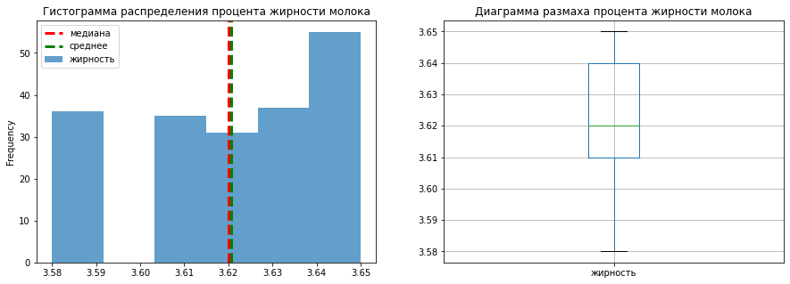
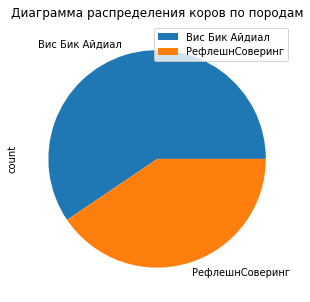

## Вступление

В рамках проекта требуется проанализировать данные фермы о коровах, их удое и качестве молока. Целью проекта является прогнозирование удоя и качества молока у данного списка коров.

Для выполнения данной цели требуется:

1. Выполнить предобработку данных

2. Провести исследовательский анализ данных, избавиться от выбросов, проанализировать распределения

3. Провести корреляционный анализ, построить матрицу корреляции и необходимые диаграммы рассеяния, при необходимости (появлении мультиколлинеарности) убрать определенные признаки, или же преобразовать для достижения линейной зависимости

4. Обучить модель линейной регрессии для прогнозирования удоя коров:

* выбрать входные признаки, влияющие на удой

* преобразовать данные, обучить модель

* проверить её эффективность по метрикам, при необходимости улучшить

* применить модель для искомых данных, определить, какие коровы подходять фермеру (по прогнозу дадут более 6000 кг молока за год)

5. Обучить модель логической регрессии для прогнозирования вкуса молокаЖ

* выбрать входные признаки, влияющие на вкус

* обучить модель

* проверить её эффективность, подобрать порог, при котором модель будет обладать максимальной точностью прогноза

* применить модель для искомых данных, определить, какие коровы подходять фермеру (по прогнозу будут давать "вкусное" молоко)

6. Дать вывод о том, каких коров фермеру следует купить

## Загрузка данных


```python
# импорт необходимых библиотек

import warnings
import pandas as pd
import numpy as np
import matplotlib.pyplot as plt
import seaborn as sns
from matplotlib.colors import ListedColormap
import scipy.stats as st

from sklearn.model_selection import train_test_split
from sklearn.preprocessing import StandardScaler, MinMaxScaler, OneHotEncoder
from sklearn.linear_model import LinearRegression, LogisticRegression
from sklearn.metrics import r2_score, mean_squared_error, mean_absolute_error,\
confusion_matrix, accuracy_score, recall_score, precision_score
```

Загрузим и изучим имеющиеся данные


```python
pd.options.mode.chained_assignment = None
warnings.filterwarnings('ignore')

df_main = pd.read_csv('/datasets/ferma_main.csv', sep = ';', decimal=",")
df_dad = pd.read_csv('/datasets/ferma_dad.csv', sep = ';', decimal=",")
df_buy = pd.read_csv('/datasets/cow_buy.csv', sep = ';', decimal=",")

def show_information(data):
    display(data.head())
    display(data.info())
    display(data.describe())

show_information(df_main)

```


<div>

<table border="1" class="dataframe">
  <thead>
    <tr style="text-align: right;">
      <th></th>
      <th>id</th>
      <th>Удой, кг</th>
      <th>ЭКЕ (Энергетическая кормовая единица)</th>
      <th>Сырой протеин, г</th>
      <th>СПО (Сахаро-протеиновое соотношение)</th>
      <th>Порода</th>
      <th>Тип пастбища</th>
      <th>порода папы_быка</th>
      <th>Жирность,%</th>
      <th>Белок,%</th>
      <th>Вкус молока</th>
      <th>Возраст</th>
    </tr>
  </thead>
  <tbody>
    <tr>
      <th>0</th>
      <td>1</td>
      <td>5863</td>
      <td>14.2</td>
      <td>1743</td>
      <td>0.890</td>
      <td>Вис Бик Айдиал</td>
      <td>Равнинное</td>
      <td>Айдиал</td>
      <td>3.58</td>
      <td>3.076</td>
      <td>вкусно</td>
      <td>более_2_лет</td>
    </tr>
    <tr>
      <th>1</th>
      <td>2</td>
      <td>5529</td>
      <td>12.8</td>
      <td>2138</td>
      <td>0.890</td>
      <td>Вис Бик Айдиал</td>
      <td>Равнинные</td>
      <td>Соверин</td>
      <td>3.54</td>
      <td>3.079</td>
      <td>вкусно</td>
      <td>менее_2_лет</td>
    </tr>
    <tr>
      <th>2</th>
      <td>3</td>
      <td>5810</td>
      <td>14.0</td>
      <td>1854</td>
      <td>0.885</td>
      <td>РефлешнСоверинг</td>
      <td>Холмистое</td>
      <td>Соверин</td>
      <td>3.59</td>
      <td>3.074</td>
      <td>не вкусно</td>
      <td>более_2_лет</td>
    </tr>
    <tr>
      <th>3</th>
      <td>4</td>
      <td>5895</td>
      <td>12.4</td>
      <td>2012</td>
      <td>0.885</td>
      <td>РефлешнСоверинг</td>
      <td>Холмистое</td>
      <td>Айдиал</td>
      <td>3.40</td>
      <td>3.075</td>
      <td>не вкусно</td>
      <td>более_2_лет</td>
    </tr>
    <tr>
      <th>4</th>
      <td>5</td>
      <td>5302</td>
      <td>12.8</td>
      <td>1675</td>
      <td>0.885</td>
      <td>Вис Бик Айдиал</td>
      <td>Равнинные</td>
      <td>Соверин</td>
      <td>3.73</td>
      <td>3.073</td>
      <td>вкусно</td>
      <td>менее_2_лет</td>
    </tr>
  </tbody>
</table>
</div>


    <class 'pandas.core.frame.DataFrame'>
    RangeIndex: 634 entries, 0 to 633
    Data columns (total 12 columns):
     #   Column                                 Non-Null Count  Dtype  
    ---  ------                                 --------------  -----  
     0   id                                     634 non-null    int64  
     1   Удой, кг                               634 non-null    int64  
     2   ЭКЕ (Энергетическая кормовая единица)  634 non-null    float64
     3   Сырой протеин, г                       634 non-null    int64  
     4   СПО (Сахаро-протеиновое соотношение)   634 non-null    float64
     5   Порода                                 634 non-null    object 
     6   Тип пастбища                           634 non-null    object 
     7   порода папы_быка                       634 non-null    object 
     8   Жирность,%                             634 non-null    float64
     9   Белок,%                                634 non-null    float64
     10  Вкус молока                            634 non-null    object 
     11  Возраст                                634 non-null    object 
    dtypes: float64(4), int64(3), object(5)
    memory usage: 59.6+ KB


    None


<div>

<table border="1" class="dataframe">
  <thead>
    <tr style="text-align: right;">
      <th></th>
      <th>id</th>
      <th>Удой, кг</th>
      <th>ЭКЕ (Энергетическая кормовая единица)</th>
      <th>Сырой протеин, г</th>
      <th>СПО (Сахаро-протеиновое соотношение)</th>
      <th>Жирность,%</th>
      <th>Белок,%</th>
    </tr>
  </thead>
  <tbody>
    <tr>
      <th>count</th>
      <td>634.000000</td>
      <td>634.000000</td>
      <td>634.000000</td>
      <td>634.000000</td>
      <td>634.000000</td>
      <td>634.000000</td>
      <td>634.000000</td>
    </tr>
    <tr>
      <th>mean</th>
      <td>317.460568</td>
      <td>6187.025237</td>
      <td>14.542744</td>
      <td>1922.682965</td>
      <td>0.912855</td>
      <td>3.603943</td>
      <td>3.075666</td>
    </tr>
    <tr>
      <th>std</th>
      <td>183.096982</td>
      <td>1638.401021</td>
      <td>1.301301</td>
      <td>182.392548</td>
      <td>0.032209</td>
      <td>0.168020</td>
      <td>0.002540</td>
    </tr>
    <tr>
      <th>min</th>
      <td>1.000000</td>
      <td>5204.000000</td>
      <td>10.900000</td>
      <td>1660.000000</td>
      <td>0.840000</td>
      <td>2.990000</td>
      <td>3.069000</td>
    </tr>
    <tr>
      <th>25%</th>
      <td>159.250000</td>
      <td>5751.750000</td>
      <td>13.500000</td>
      <td>1772.250000</td>
      <td>0.890000</td>
      <td>3.590000</td>
      <td>3.074000</td>
    </tr>
    <tr>
      <th>50%</th>
      <td>317.500000</td>
      <td>6130.500000</td>
      <td>14.700000</td>
      <td>1880.500000</td>
      <td>0.930000</td>
      <td>3.650000</td>
      <td>3.076000</td>
    </tr>
    <tr>
      <th>75%</th>
      <td>475.750000</td>
      <td>6501.000000</td>
      <td>15.600000</td>
      <td>2058.750000</td>
      <td>0.940000</td>
      <td>3.720000</td>
      <td>3.077000</td>
    </tr>
    <tr>
      <th>max</th>
      <td>629.000000</td>
      <td>45616.000000</td>
      <td>16.800000</td>
      <td>2349.000000</td>
      <td>0.960000</td>
      <td>3.750000</td>
      <td>3.085000</td>
    </tr>
  </tbody>
</table>
</div>


Как мы видим, пропуски в данных датафрейма *df_main* отсутствуют, однако типы данных столбцов неверные (некоторые столбцы следует перевести из типа *object* в тип *float64*).


```python
show_information(df_dad)
```


<div>

<table border="1" class="dataframe">
  <thead>
    <tr style="text-align: right;">
      <th></th>
      <th>id</th>
      <th>Имя Папы</th>
    </tr>
  </thead>
  <tbody>
    <tr>
      <th>0</th>
      <td>1</td>
      <td>Буйный</td>
    </tr>
    <tr>
      <th>1</th>
      <td>2</td>
      <td>Соловчик</td>
    </tr>
    <tr>
      <th>2</th>
      <td>3</td>
      <td>Барин</td>
    </tr>
    <tr>
      <th>3</th>
      <td>4</td>
      <td>Буйный</td>
    </tr>
    <tr>
      <th>4</th>
      <td>5</td>
      <td>Барин</td>
    </tr>
  </tbody>
</table>
</div>


    <class 'pandas.core.frame.DataFrame'>
    RangeIndex: 629 entries, 0 to 628
    Data columns (total 2 columns):
     #   Column    Non-Null Count  Dtype 
    ---  ------    --------------  ----- 
     0   id        629 non-null    int64 
     1   Имя Папы  629 non-null    object
    dtypes: int64(1), object(1)
    memory usage: 10.0+ KB


    None


<div>

<table border="1" class="dataframe">
  <thead>
    <tr style="text-align: right;">
      <th></th>
      <th>id</th>
    </tr>
  </thead>
  <tbody>
    <tr>
      <th>count</th>
      <td>629.00000</td>
    </tr>
    <tr>
      <th>mean</th>
      <td>315.00000</td>
    </tr>
    <tr>
      <th>std</th>
      <td>181.72094</td>
    </tr>
    <tr>
      <th>min</th>
      <td>1.00000</td>
    </tr>
    <tr>
      <th>25%</th>
      <td>158.00000</td>
    </tr>
    <tr>
      <th>50%</th>
      <td>315.00000</td>
    </tr>
    <tr>
      <th>75%</th>
      <td>472.00000</td>
    </tr>
    <tr>
      <th>max</th>
      <td>629.00000</td>
    </tr>
  </tbody>
</table>
</div>


Никаких явных проблем с данными нет (*в целом, следует задуматься, имеет ли смысл оставлять эту таблицу как отдельную впринципе*)


```python
show_information(df_buy)
```


<div>

<table border="1" class="dataframe">
  <thead>
    <tr style="text-align: right;">
      <th></th>
      <th>Порода</th>
      <th>Тип пастбища</th>
      <th>порода папы_быка</th>
      <th>Имя_папы</th>
      <th>Текущая_жирность,%</th>
      <th>Текущий_уровень_белок,%</th>
      <th>Возраст</th>
    </tr>
  </thead>
  <tbody>
    <tr>
      <th>0</th>
      <td>Вис Бик Айдиал</td>
      <td>холмистое</td>
      <td>Айдиал</td>
      <td>Геркулес</td>
      <td>3.58</td>
      <td>3.076</td>
      <td>более_2_лет</td>
    </tr>
    <tr>
      <th>1</th>
      <td>Вис Бик Айдиал</td>
      <td>равнинное</td>
      <td>Соверин</td>
      <td>Буйный</td>
      <td>3.54</td>
      <td>3.081</td>
      <td>менее_2_лет</td>
    </tr>
    <tr>
      <th>2</th>
      <td>РефлешнСоверинг</td>
      <td>равнинное</td>
      <td>Соверин</td>
      <td>Барин</td>
      <td>3.59</td>
      <td>3.074</td>
      <td>более_2_лет</td>
    </tr>
    <tr>
      <th>3</th>
      <td>РефлешнСоверинг</td>
      <td>холмистое</td>
      <td>Айдиал</td>
      <td>Буйный</td>
      <td>3.40</td>
      <td>3.061</td>
      <td>более_2_лет</td>
    </tr>
    <tr>
      <th>4</th>
      <td>РефлешнСоверинг</td>
      <td>равнинное</td>
      <td>Айдиал</td>
      <td>Буйный</td>
      <td>3.64</td>
      <td>3.074</td>
      <td>более_2_лет</td>
    </tr>
  </tbody>
</table>
</div>


    <class 'pandas.core.frame.DataFrame'>
    RangeIndex: 20 entries, 0 to 19
    Data columns (total 7 columns):
     #   Column                   Non-Null Count  Dtype  
    ---  ------                   --------------  -----  
     0   Порода                   20 non-null     object 
     1   Тип пастбища             20 non-null     object 
     2   порода папы_быка         20 non-null     object 
     3   Имя_папы                 20 non-null     object 
     4   Текущая_жирность,%       20 non-null     float64
     5   Текущий_уровень_белок,%  20 non-null     float64
     6   Возраст                  20 non-null     object 
    dtypes: float64(2), object(5)
    memory usage: 1.2+ KB


    None


<div>

<table border="1" class="dataframe">
  <thead>
    <tr style="text-align: right;">
      <th></th>
      <th>Текущая_жирность,%</th>
      <th>Текущий_уровень_белок,%</th>
    </tr>
  </thead>
  <tbody>
    <tr>
      <th>count</th>
      <td>20.000000</td>
      <td>20.000000</td>
    </tr>
    <tr>
      <th>mean</th>
      <td>3.577500</td>
      <td>3.069500</td>
    </tr>
    <tr>
      <th>std</th>
      <td>0.126818</td>
      <td>0.010339</td>
    </tr>
    <tr>
      <th>min</th>
      <td>3.340000</td>
      <td>3.046000</td>
    </tr>
    <tr>
      <th>25%</th>
      <td>3.510000</td>
      <td>3.064000</td>
    </tr>
    <tr>
      <th>50%</th>
      <td>3.590000</td>
      <td>3.074000</td>
    </tr>
    <tr>
      <th>75%</th>
      <td>3.650000</td>
      <td>3.076000</td>
    </tr>
    <tr>
      <th>max</th>
      <td>3.770000</td>
      <td>3.081000</td>
    </tr>
  </tbody>
</table>
</div>


Нулевых строк нет, проблемы с данными такие же, как и в *df_main*

##  Предобработка данных

### Переименование столбцов


```python
# Переводить названия столбцов на английский не будем, но приведём их к корректному виду
# Помимо этого уберем из названия столбцов единицы измерения и расшифровки аббревиатур, чтобы названия не были такими громоздкими
# А также просто лишнюю очевидную информацию (порода папы быка - без слова "бык" можно обойтись)
#df_main
df_main = df_main.rename(columns = {'Удой, кг': 'удой', 'ЭКЕ (Энергетическая кормовая единица)': 'эке', \
                                   'Сырой протеин, г': 'сырой_протеин', 'СПО (Сахаро-протеиновое соотношение)' : 'спо', \
                                   'Тип пастбища':'тип_пастбища', 'порода папы_быка':'порода_папы',\
                                   'Жирность,%':'жирность', 'Белок,%' : 'белок', 'Вкус молока': 'вкус'})
df_main = df_main.rename(str.lower, axis = 'columns')
display(df_main.head())

#df_dad
df_dad = df_dad.rename(columns = {'Имя Папы': 'имя_папы'})
display(df_dad.head())

#df_buy
df_buy = df_buy.rename(columns = {'Тип пастбища':'тип_пастбища', 'порода папы_быка' : 'порода_папы',\
                                  'Текущая_жирность,%':'текущая_жирность', 'Текущий_уровень_белок,%':'Текущий_белок'})
df_buy = df_buy.rename(str.lower, axis = 'columns')
display(df_buy.head())
```


<div>

<table border="1" class="dataframe">
  <thead>
    <tr style="text-align: right;">
      <th></th>
      <th>id</th>
      <th>удой</th>
      <th>эке</th>
      <th>сырой_протеин</th>
      <th>спо</th>
      <th>порода</th>
      <th>тип_пастбища</th>
      <th>порода_папы</th>
      <th>жирность</th>
      <th>белок</th>
      <th>вкус</th>
      <th>возраст</th>
    </tr>
  </thead>
  <tbody>
    <tr>
      <th>0</th>
      <td>1</td>
      <td>5863</td>
      <td>14.2</td>
      <td>1743</td>
      <td>0.890</td>
      <td>Вис Бик Айдиал</td>
      <td>Равнинное</td>
      <td>Айдиал</td>
      <td>3.58</td>
      <td>3.076</td>
      <td>вкусно</td>
      <td>более_2_лет</td>
    </tr>
    <tr>
      <th>1</th>
      <td>2</td>
      <td>5529</td>
      <td>12.8</td>
      <td>2138</td>
      <td>0.890</td>
      <td>Вис Бик Айдиал</td>
      <td>Равнинные</td>
      <td>Соверин</td>
      <td>3.54</td>
      <td>3.079</td>
      <td>вкусно</td>
      <td>менее_2_лет</td>
    </tr>
    <tr>
      <th>2</th>
      <td>3</td>
      <td>5810</td>
      <td>14.0</td>
      <td>1854</td>
      <td>0.885</td>
      <td>РефлешнСоверинг</td>
      <td>Холмистое</td>
      <td>Соверин</td>
      <td>3.59</td>
      <td>3.074</td>
      <td>не вкусно</td>
      <td>более_2_лет</td>
    </tr>
    <tr>
      <th>3</th>
      <td>4</td>
      <td>5895</td>
      <td>12.4</td>
      <td>2012</td>
      <td>0.885</td>
      <td>РефлешнСоверинг</td>
      <td>Холмистое</td>
      <td>Айдиал</td>
      <td>3.40</td>
      <td>3.075</td>
      <td>не вкусно</td>
      <td>более_2_лет</td>
    </tr>
    <tr>
      <th>4</th>
      <td>5</td>
      <td>5302</td>
      <td>12.8</td>
      <td>1675</td>
      <td>0.885</td>
      <td>Вис Бик Айдиал</td>
      <td>Равнинные</td>
      <td>Соверин</td>
      <td>3.73</td>
      <td>3.073</td>
      <td>вкусно</td>
      <td>менее_2_лет</td>
    </tr>
  </tbody>
</table>
</div>


<div>

<table border="1" class="dataframe">
  <thead>
    <tr style="text-align: right;">
      <th></th>
      <th>id</th>
      <th>имя_папы</th>
    </tr>
  </thead>
  <tbody>
    <tr>
      <th>0</th>
      <td>1</td>
      <td>Буйный</td>
    </tr>
    <tr>
      <th>1</th>
      <td>2</td>
      <td>Соловчик</td>
    </tr>
    <tr>
      <th>2</th>
      <td>3</td>
      <td>Барин</td>
    </tr>
    <tr>
      <th>3</th>
      <td>4</td>
      <td>Буйный</td>
    </tr>
    <tr>
      <th>4</th>
      <td>5</td>
      <td>Барин</td>
    </tr>
  </tbody>
</table>
</div>


<div>

<table border="1" class="dataframe">
  <thead>
    <tr style="text-align: right;">
      <th></th>
      <th>порода</th>
      <th>тип_пастбища</th>
      <th>порода_папы</th>
      <th>имя_папы</th>
      <th>текущая_жирность</th>
      <th>текущий_белок</th>
      <th>возраст</th>
    </tr>
  </thead>
  <tbody>
    <tr>
      <th>0</th>
      <td>Вис Бик Айдиал</td>
      <td>холмистое</td>
      <td>Айдиал</td>
      <td>Геркулес</td>
      <td>3.58</td>
      <td>3.076</td>
      <td>более_2_лет</td>
    </tr>
    <tr>
      <th>1</th>
      <td>Вис Бик Айдиал</td>
      <td>равнинное</td>
      <td>Соверин</td>
      <td>Буйный</td>
      <td>3.54</td>
      <td>3.081</td>
      <td>менее_2_лет</td>
    </tr>
    <tr>
      <th>2</th>
      <td>РефлешнСоверинг</td>
      <td>равнинное</td>
      <td>Соверин</td>
      <td>Барин</td>
      <td>3.59</td>
      <td>3.074</td>
      <td>более_2_лет</td>
    </tr>
    <tr>
      <th>3</th>
      <td>РефлешнСоверинг</td>
      <td>холмистое</td>
      <td>Айдиал</td>
      <td>Буйный</td>
      <td>3.40</td>
      <td>3.061</td>
      <td>более_2_лет</td>
    </tr>
    <tr>
      <th>4</th>
      <td>РефлешнСоверинг</td>
      <td>равнинное</td>
      <td>Айдиал</td>
      <td>Буйный</td>
      <td>3.64</td>
      <td>3.074</td>
      <td>более_2_лет</td>
    </tr>
  </tbody>
</table>
</div>


Названия столбцов приведены к единому виду

### Изменение типов данных

Приведём некоторые столбцы типа *object* к *float*


```python
df_main['эке'].unique()
```


    array([14.2, 12.8, 14. , 12.4, 12.7, 13.2, 14.7, 13.4, 13.7, 16.5, 15.4,
           14.5, 16. , 15.6, 11.5, 15.7, 14.3, 15.5, 14.6, 15.9, 15.2, 14.8,
           16.4, 11.8, 14.4, 16.1, 12.9, 13.8, 13.3, 16.3, 13.9, 14.1, 16.7,
           15.8, 16.2, 12.2, 14.9, 13.6, 12.5, 16.8, 13.5, 15.1, 12.1, 16.6,
           15.3, 13.1, 12.3, 11.9, 12.6, 15. , 13. , 12. , 11.1, 11.7, 10.9])


Типы данных изменены на подходящие.

### Проверка данных на дубликаты

На этапе знакомства с данными уже было выяснено, что пропуски в данных отсутствуют. Теперь проверим их на дубликаты


```python
# явные дубликаты

df_main = df_main.drop_duplicates()
print(df_main.shape)
df_dad = df_dad.drop_duplicates()
print(df_dad.shape)
df_buy = df_buy.drop_duplicates()
print(df_buy.shape)
```

    (629, 12)
    (629, 2)
    (16, 7)


Как мы видим, дубликаты в данных были: из таблицы *df_main* было удалено 6 строк, из таблицы *df_buy* - 4 строки

*Возникает вопрос, не могло ли просто получиться так, что у 2 коров совпали все параметры (особенно в таблице df_buy, в которой из 20 строк 4 оказались дубликатами)*

Теперь проверим данные на неявные дубликаты


```python
#df_main

def check_unique(data):
    for i in data.columns.tolist():
        if data[i].dtype == 'object':
            print('    ', i + ':')
            print('    ',data[i].unique())
            
print('df_main:')
check_unique(df_main)

print('df_buy:')
check_unique(df_buy)
```

    df_main:
         порода:
         ['Вис Бик Айдиал' 'РефлешнСоверинг']
         тип_пастбища:
         ['Равнинное' 'Равнинные' 'Холмистое']
         порода_папы:
         ['Айдиал' 'Соверин' 'Айдиалл']
         вкус:
         ['вкусно' 'не вкусно']
         возраст:
         ['более_2_лет' 'менее_2_лет']
    df_buy:
         порода:
         ['Вис Бик Айдиал' 'РефлешнСоверинг']
         тип_пастбища:
         ['холмистое' 'равнинное']
         порода_папы:
         ['Айдиал' 'Соверин']
         имя_папы:
         ['Геркулес' 'Буйный' 'Барин' 'Соловчик']
         возраст:
         ['более_2_лет' 'менее_2_лет']


Как можно увидеть, в таблице *df_main* есть неявные дубликаты данных:

* 'Равнинное' и 'Равнинные' в столбце 'тип_пастбища'

* 'Айдиал' и 'Айдиалл' в столбце 'порода_папы'

Устраним эти дубликаты и проверим всю таблицу на дубликаты снова.

(Также понизим регистр в *df["тип_пастбища"]*, чтобы его значения совпадали со значениями в таблице *df_buy*)


```python
df_main['тип_пастбища'] = df_main['тип_пастбища'].str.replace('Равнинные', 'Равнинное').str.lower()
df_main['порода_папы'] = df_main['порода_папы'].str.replace('Айдиалл', 'Айдиал')

check_unique(df_main)
df_main = df_main.drop_duplicates()
print(df_main.shape)
```

         порода:
         ['Вис Бик Айдиал' 'РефлешнСоверинг']
         тип_пастбища:
         ['равнинное' 'холмистое']
         порода_папы:
         ['Айдиал' 'Соверин']
         вкус:
         ['вкусно' 'не вкусно']
         возраст:
         ['более_2_лет' 'менее_2_лет']
    (629, 12)


Неявные дубликаты также устранены.

## Исследовательский анализ данных

### Статистический анализ


```python
display(df_main.describe())
print('Количество коров с удоем более 7500 кг:', len(df_main.query('удой > 7500')))
print('Количество коров с жирностью молока менее 3.15%:', len(df_main.query('жирность < 3.15'))/len(df_main))
```


<div>

<table border="1" class="dataframe">
  <thead>
    <tr style="text-align: right;">
      <th></th>
      <th>id</th>
      <th>удой</th>
      <th>эке</th>
      <th>сырой_протеин</th>
      <th>спо</th>
      <th>жирность</th>
      <th>белок</th>
    </tr>
  </thead>
  <tbody>
    <tr>
      <th>count</th>
      <td>629.00000</td>
      <td>629.000000</td>
      <td>629.000000</td>
      <td>629.000000</td>
      <td>629.000000</td>
      <td>629.000000</td>
      <td>629.000000</td>
    </tr>
    <tr>
      <th>mean</th>
      <td>315.00000</td>
      <td>6188.750397</td>
      <td>14.543879</td>
      <td>1923.364070</td>
      <td>0.913116</td>
      <td>3.603657</td>
      <td>3.075671</td>
    </tr>
    <tr>
      <th>std</th>
      <td>181.72094</td>
      <td>1644.795489</td>
      <td>1.306408</td>
      <td>182.956251</td>
      <td>0.032203</td>
      <td>0.168656</td>
      <td>0.002549</td>
    </tr>
    <tr>
      <th>min</th>
      <td>1.00000</td>
      <td>5204.000000</td>
      <td>10.900000</td>
      <td>1660.000000</td>
      <td>0.840000</td>
      <td>2.990000</td>
      <td>3.069000</td>
    </tr>
    <tr>
      <th>25%</th>
      <td>158.00000</td>
      <td>5751.000000</td>
      <td>13.500000</td>
      <td>1771.000000</td>
      <td>0.890000</td>
      <td>3.590000</td>
      <td>3.074000</td>
    </tr>
    <tr>
      <th>50%</th>
      <td>315.00000</td>
      <td>6133.000000</td>
      <td>14.700000</td>
      <td>1888.000000</td>
      <td>0.930000</td>
      <td>3.650000</td>
      <td>3.076000</td>
    </tr>
    <tr>
      <th>75%</th>
      <td>472.00000</td>
      <td>6501.000000</td>
      <td>15.600000</td>
      <td>2062.000000</td>
      <td>0.940000</td>
      <td>3.720000</td>
      <td>3.077000</td>
    </tr>
    <tr>
      <th>max</th>
      <td>629.00000</td>
      <td>45616.000000</td>
      <td>16.800000</td>
      <td>2349.000000</td>
      <td>0.960000</td>
      <td>3.750000</td>
      <td>3.085000</td>
    </tr>
  </tbody>
</table>
</div>


    Количество коров с удоем более 7500 кг: 1
    Количество коров с жирностью молока менее 3.15%: 0.025437201907790145


В датафрейме *df_main* явные выбросы видны в столбцах *удой*: максимальное значение более 45000 кг при третьем квартиле в ~6500 кг. Проверив долю коров с удоем более 7500кг убеждаемся, что это лишь 1 корова с аномальным удоем. Уберем её из выборки


```python
df_main = df_main.query('удой < 8000').query('жирность >= 3.15')
```


```python
display(df_buy.describe())
```


<div>

<table border="1" class="dataframe">
  <thead>
    <tr style="text-align: right;">
      <th></th>
      <th>текущая_жирность</th>
      <th>текущий_белок</th>
    </tr>
  </thead>
  <tbody>
    <tr>
      <th>count</th>
      <td>16.000000</td>
      <td>16.000000</td>
    </tr>
    <tr>
      <th>mean</th>
      <td>3.571875</td>
      <td>3.068250</td>
    </tr>
    <tr>
      <th>std</th>
      <td>0.141620</td>
      <td>0.011264</td>
    </tr>
    <tr>
      <th>min</th>
      <td>3.340000</td>
      <td>3.046000</td>
    </tr>
    <tr>
      <th>25%</th>
      <td>3.415000</td>
      <td>3.059500</td>
    </tr>
    <tr>
      <th>50%</th>
      <td>3.585000</td>
      <td>3.073500</td>
    </tr>
    <tr>
      <th>75%</th>
      <td>3.692500</td>
      <td>3.076750</td>
    </tr>
    <tr>
      <th>max</th>
      <td>3.770000</td>
      <td>3.081000</td>
    </tr>
  </tbody>
</table>
</div>


В таблице *df_buy* аномальных выбросов не обнаружено

### Графики распределения признаков

#### Количественные признаки


```python
def show_hist_metrics(sign, bins, title): #выводит изображение гистограммы с отмеченными медианой и средним
    sign.plot(kind = 'hist', bins = bins, alpha = 0.7, title = title)
    plt.axvline(x=np.nanmedian (sign), color='red', linestyle='--', linewidth= 3 , label='медиана') 
    plt.axvline(x=np.nanmean (sign), color='green', linestyle='--', linewidth= 3 , label='среднее') 
    plt.legend()
    plt.show()

def show_hist_boxplot(df,sign, bins, title1, title2): #выводит изображение гистограммы с отмеченными медианой и средним и ящик с усами
    #plt_hist, plt_box = plt.subplots(nrows=1, ncols=2)
    plt.rcParams ['figure.figsize'] = [15, 5]
    plt.subplot(1, 2, 1)
    df[sign].plot(kind = 'hist', bins = bins, alpha = 0.7, title = title1)
    plt.axvline(x=np.nanmedian (df[sign]), color='red', linestyle='--', linewidth= 3 , label='медиана') 
    plt.axvline(x=np.nanmean (df[sign]), color='green', linestyle='--', linewidth= 3 , label='среднее') 
    plt.legend()
    plt.subplot(1, 2, 2)
    df.boxplot(sign)
    plt.title(title2)
    plt.show()    

show_hist_boxplot(df_main, 'удой', 30, 'Гистограмма распределения удоя коров (кг)', 'Диаграмма размаха удоя коров (кг)')
```


    

    


Гистограмма распределения удоя коров отдалённо напоминает нормальное распределение


```python
show_hist_boxplot(df_main, 'эке', 30, 'Гистограмма распределения уровня энергетической кормовой единицы',\
                 'Диаграмма размаха уровня энергетической кормовой единицы')
```


    

    


```python
show_hist_boxplot(df_main, 'сырой_протеин', 30, 'Гистограмма распределения количества сырого протеина в корме (г)',\
                 'Диаграмма размаха количества сырого протеина в корме (г)')
```


    

    


```python
show_hist_boxplot(df_main, 'спо', 30, 'Гистограмма распределения сахаро-протеинового отношения',\
                 'Диаграмма размаха сахаро-протеинового отношения')
```


    

    


```python
show_hist_boxplot(df_main, 'белок', 30, 'Гистограмма распределения процента белка в молоке',\
                 'Диаграмма размаха процента белка в молоке')
```


    

    


```python
show_hist_boxplot(df_main, 'жирность', 30, 'Гистограмма распределения процента жирности молока',\
                 'Диаграмма размаха процента жирности молока')
```


    

    


По виду гистограммы распределения признака *жирность* можно заметить мультимодальность признака: 2 явных пика - в районе 3.63 и 3.73. Также из-за этого на диаграмме размаха видно огромное количество выбросов. В целом, гистограмму можно разделить на 3, каждая из которых будет похожа на нормальное распределение: до 3.55, от 3.55 до 3.69 и от 3.69. Посмотрим, как будут выглядеть эти графики


```python
show_hist_boxplot(df_main.query('жирность <= 3.57'), 'жирность', 6, 'Гистограмма распределения процента жирности молока',\
                 'Диаграмма размаха процента жирности молока')
show_hist_boxplot(df_main.query('3.57 < жирность < 3.69'), 'жирность', 6, 'Гистограмма распределения процента жирности молока',\
                 'Диаграмма размаха процента жирности молока')
show_hist_boxplot(df_main.query('жирность >= 3.69'), 'жирность', 6, 'Гистограмма распределения процента жирности молока',\
                 'Диаграмма размаха процента жирности молока')
```


    

    


    

    


    

    


Распределения полученных трёх групп хоть и не сильно напоминают нормальное, однако в них отсутствует бимодальность и нет выбросов. По этой причине было принято решение вместо количественного признака *жирность* ввести категориальный *уровень_жирности*. У категориального признака *уровень_жирности* есть 3 значения:
* *легкое* - жирность 3.57% и менее

* *среднее* - жирность от 3.57% до 3.69%

* *жирное* - жирность 3.69% и выше

*признак "жирность" сохраним, однако постараемся не использовать его*


```python
# изменение признака "жирность" на категориальный
def fat_calc (fat):
    if fat <= 3.57:
        return 'легкое'
    if fat < 3.69:
        return 'среднее'
    return 'жирное'

df_main['уровень_жирности'] = df_main['жирность'].apply(fat_calc)
df_main.head()
```


<div>

<table border="1" class="dataframe">
  <thead>
    <tr style="text-align: right;">
      <th></th>
      <th>id</th>
      <th>удой</th>
      <th>эке</th>
      <th>сырой_протеин</th>
      <th>спо</th>
      <th>порода</th>
      <th>тип_пастбища</th>
      <th>порода_папы</th>
      <th>жирность</th>
      <th>белок</th>
      <th>вкус</th>
      <th>возраст</th>
      <th>уровень_жирности</th>
    </tr>
  </thead>
  <tbody>
    <tr>
      <th>0</th>
      <td>1</td>
      <td>5863</td>
      <td>14.2</td>
      <td>1743</td>
      <td>0.890</td>
      <td>Вис Бик Айдиал</td>
      <td>равнинное</td>
      <td>Айдиал</td>
      <td>3.58</td>
      <td>3.076</td>
      <td>вкусно</td>
      <td>более_2_лет</td>
      <td>среднее</td>
    </tr>
    <tr>
      <th>1</th>
      <td>2</td>
      <td>5529</td>
      <td>12.8</td>
      <td>2138</td>
      <td>0.890</td>
      <td>Вис Бик Айдиал</td>
      <td>равнинное</td>
      <td>Соверин</td>
      <td>3.54</td>
      <td>3.079</td>
      <td>вкусно</td>
      <td>менее_2_лет</td>
      <td>легкое</td>
    </tr>
    <tr>
      <th>2</th>
      <td>3</td>
      <td>5810</td>
      <td>14.0</td>
      <td>1854</td>
      <td>0.885</td>
      <td>РефлешнСоверинг</td>
      <td>холмистое</td>
      <td>Соверин</td>
      <td>3.59</td>
      <td>3.074</td>
      <td>не вкусно</td>
      <td>более_2_лет</td>
      <td>среднее</td>
    </tr>
    <tr>
      <th>3</th>
      <td>4</td>
      <td>5895</td>
      <td>12.4</td>
      <td>2012</td>
      <td>0.885</td>
      <td>РефлешнСоверинг</td>
      <td>холмистое</td>
      <td>Айдиал</td>
      <td>3.40</td>
      <td>3.075</td>
      <td>не вкусно</td>
      <td>более_2_лет</td>
      <td>легкое</td>
    </tr>
    <tr>
      <th>4</th>
      <td>5</td>
      <td>5302</td>
      <td>12.8</td>
      <td>1675</td>
      <td>0.885</td>
      <td>Вис Бик Айдиал</td>
      <td>равнинное</td>
      <td>Соверин</td>
      <td>3.73</td>
      <td>3.073</td>
      <td>вкусно</td>
      <td>менее_2_лет</td>
      <td>жирное</td>
    </tr>
  </tbody>
</table>
</div>


Такой же признак нужно добавить и в таблицу *df_buy*


```python
df_buy['уровень_жирности'] = df_buy['текущая_жирность'].apply(fat_calc)
df_buy.head()
```


<div>

<table border="1" class="dataframe">
  <thead>
    <tr style="text-align: right;">
      <th></th>
      <th>порода</th>
      <th>тип_пастбища</th>
      <th>порода_папы</th>
      <th>имя_папы</th>
      <th>текущая_жирность</th>
      <th>текущий_белок</th>
      <th>возраст</th>
      <th>уровень_жирности</th>
    </tr>
  </thead>
  <tbody>
    <tr>
      <th>0</th>
      <td>Вис Бик Айдиал</td>
      <td>холмистое</td>
      <td>Айдиал</td>
      <td>Геркулес</td>
      <td>3.58</td>
      <td>3.076</td>
      <td>более_2_лет</td>
      <td>среднее</td>
    </tr>
    <tr>
      <th>1</th>
      <td>Вис Бик Айдиал</td>
      <td>равнинное</td>
      <td>Соверин</td>
      <td>Буйный</td>
      <td>3.54</td>
      <td>3.081</td>
      <td>менее_2_лет</td>
      <td>легкое</td>
    </tr>
    <tr>
      <th>2</th>
      <td>РефлешнСоверинг</td>
      <td>равнинное</td>
      <td>Соверин</td>
      <td>Барин</td>
      <td>3.59</td>
      <td>3.074</td>
      <td>более_2_лет</td>
      <td>среднее</td>
    </tr>
    <tr>
      <th>3</th>
      <td>РефлешнСоверинг</td>
      <td>холмистое</td>
      <td>Айдиал</td>
      <td>Буйный</td>
      <td>3.40</td>
      <td>3.061</td>
      <td>более_2_лет</td>
      <td>легкое</td>
    </tr>
    <tr>
      <th>4</th>
      <td>РефлешнСоверинг</td>
      <td>равнинное</td>
      <td>Айдиал</td>
      <td>Буйный</td>
      <td>3.64</td>
      <td>3.074</td>
      <td>более_2_лет</td>
      <td>среднее</td>
    </tr>
  </tbody>
</table>
</div>


Как можно увидеть, распределение большей часть признаков в датасете далеко от нормального (напоминают нормальное распределение лишь распределение признаков *удой* и *белок*). Однако дело здесь не в выбросах данных, а просто таковы особенности выборки


```python
show_hist_boxplot(df_buy, 'текущая_жирность', 30, 'Гистограмма распределения процента жирности молока покупаемых коров',\
                 'Диаграмма размаха процента жирности молока покупаемых коров')
```


    

    


```python
show_hist_boxplot(df_buy, 'текущий_белок', 30, 'Гистограмма распределения процента белка в молоке покупаемых коров',\
                 'Диаграмма размаха процента белка в молоке покупаемых коров')
```


    

    


Про вид распределения количественных признаков в датафрейме *cow_buy* нельзя что-либо сказать, так как объём данных слишком мал

Теперь посмотрим на распределение категориальных признаков

#### Категориальные признаки


```python
def show_pie(df, col, val, tit):
    temp = pd.pivot_table(df, index = col, values = val, aggfunc = 'count')
    temp.columns = ['count']
    temp['percentage'] = temp['count']/len(df)
    temp.plot(kind = 'pie', y = 'count', title = tit)
    display(temp)
    plt.show()
show_pie(df_main, 'порода', 'id', 'Диаграмма распределения коров по породам')
show_pie(df_buy, 'порода',  'возраст', 'Диаграмма распределения коров для покупки по породам')
```


<div>

<table border="1" class="dataframe">
  <thead>
    <tr style="text-align: right;">
      <th></th>
      <th>count</th>
      <th>percentage</th>
    </tr>
    <tr>
      <th>порода</th>
      <th></th>
      <th></th>
    </tr>
  </thead>
  <tbody>
    <tr>
      <th>Вис Бик Айдиал</th>
      <td>364</td>
      <td>0.594771</td>
    </tr>
    <tr>
      <th>РефлешнСоверинг</th>
      <td>248</td>
      <td>0.405229</td>
    </tr>
  </tbody>
</table>
</div>


    

    


<div>

<table border="1" class="dataframe">
  <thead>
    <tr style="text-align: right;">
      <th></th>
      <th>count</th>
      <th>percentage</th>
    </tr>
    <tr>
      <th>порода</th>
      <th></th>
      <th></th>
    </tr>
  </thead>
  <tbody>
    <tr>
      <th>Вис Бик Айдиал</th>
      <td>8</td>
      <td>0.5</td>
    </tr>
    <tr>
      <th>РефлешнСоверинг</th>
      <td>8</td>
      <td>0.5</td>
    </tr>
  </tbody>
</table>
</div>


    

    


Как мы видим, в исходной выборке по породам есть заметный перевес в сторону породы Вис Бик Айдал (отношение двух пород примерно 60:40), а в списке коров для покупки коров обеих пород поровну. Однако вероятно такой перевес не очень значим (всё ещё достаточно коров каждой породы для считывания закономерностей)


```python
df_main.info()
df_buy.info()
show_pie(df_main, 'тип_пастбища', 'id', 'Диаграмма распределения коров по типу пастбища')
show_pie(df_buy, 'тип_пастбища', 'возраст', 'Диаграмма распределения коров для покупки по типу пастбища')
```

    <class 'pandas.core.frame.DataFrame'>
    Int64Index: 612 entries, 0 to 628
    Data columns (total 13 columns):
     #   Column            Non-Null Count  Dtype  
    ---  ------            --------------  -----  
     0   id                612 non-null    int64  
     1   удой              612 non-null    int64  
     2   эке               612 non-null    float64
     3   сырой_протеин     612 non-null    int64  
     4   спо               612 non-null    float64
     5   порода            612 non-null    object 
     6   тип_пастбища      612 non-null    object 
     7   порода_папы       612 non-null    object 
     8   жирность          612 non-null    float64
     9   белок             612 non-null    float64
     10  вкус              612 non-null    object 
     11  возраст           612 non-null    object 
     12  уровень_жирности  612 non-null    object 
    dtypes: float64(4), int64(3), object(6)
    memory usage: 66.9+ KB
    <class 'pandas.core.frame.DataFrame'>
    Int64Index: 16 entries, 0 to 18
    Data columns (total 8 columns):
     #   Column            Non-Null Count  Dtype  
    ---  ------            --------------  -----  
     0   порода            16 non-null     object 
     1   тип_пастбища      16 non-null     object 
     2   порода_папы       16 non-null     object 
     3   имя_папы          16 non-null     object 
     4   текущая_жирность  16 non-null     float64
     5   текущий_белок     16 non-null     float64
     6   возраст           16 non-null     object 
     7   уровень_жирности  16 non-null     object 
    dtypes: float64(2), object(6)
    memory usage: 1.1+ KB


<div>

<table border="1" class="dataframe">
  <thead>
    <tr style="text-align: right;">
      <th></th>
      <th>count</th>
      <th>percentage</th>
    </tr>
    <tr>
      <th>тип_пастбища</th>
      <th></th>
      <th></th>
    </tr>
  </thead>
  <tbody>
    <tr>
      <th>равнинное</th>
      <td>272</td>
      <td>0.444444</td>
    </tr>
    <tr>
      <th>холмистое</th>
      <td>340</td>
      <td>0.555556</td>
    </tr>
  </tbody>
</table>
</div>


    

    


<div>

<table border="1" class="dataframe">
  <thead>
    <tr style="text-align: right;">
      <th></th>
      <th>count</th>
      <th>percentage</th>
    </tr>
    <tr>
      <th>тип_пастбища</th>
      <th></th>
      <th></th>
    </tr>
  </thead>
  <tbody>
    <tr>
      <th>равнинное</th>
      <td>8</td>
      <td>0.5</td>
    </tr>
    <tr>
      <th>холмистое</th>
      <td>8</td>
      <td>0.5</td>
    </tr>
  </tbody>
</table>
</div>


    

    


Ситуация такая же, как и с признаком *порода*


```python
show_pie(df_main, 'порода_папы', 'id','Диаграмма распределения коров по породе пап')
show_pie(df_buy, 'порода_папы', 'возраст', 'Диаграмма распределения коров для покупки по породе пап')
```


<div>

<table border="1" class="dataframe">
  <thead>
    <tr style="text-align: right;">
      <th></th>
      <th>count</th>
      <th>percentage</th>
    </tr>
    <tr>
      <th>порода_папы</th>
      <th></th>
      <th></th>
    </tr>
  </thead>
  <tbody>
    <tr>
      <th>Айдиал</th>
      <td>310</td>
      <td>0.506536</td>
    </tr>
    <tr>
      <th>Соверин</th>
      <td>302</td>
      <td>0.493464</td>
    </tr>
  </tbody>
</table>
</div>


    

    


<div>

<table border="1" class="dataframe">
  <thead>
    <tr style="text-align: right;">
      <th></th>
      <th>count</th>
      <th>percentage</th>
    </tr>
    <tr>
      <th>порода_папы</th>
      <th></th>
      <th></th>
    </tr>
  </thead>
  <tbody>
    <tr>
      <th>Айдиал</th>
      <td>6</td>
      <td>0.375</td>
    </tr>
    <tr>
      <th>Соверин</th>
      <td>10</td>
      <td>0.625</td>
    </tr>
  </tbody>
</table>
</div>


    

    


Тут ситуация обратная: в общей выборке количество коров двух пород почти совпадает, а в списке коров для покупки есть перевес. Однако это также не должно повлиять на качество прогноза


```python
show_pie(df_main, 'возраст', 'id', 'Диаграмма распределения коров по возрасту')
show_pie(df_buy, 'возраст', 'уровень_жирности', 'Диаграмма распределения коров для покупки по возрасту')
```


<div>

<table border="1" class="dataframe">
  <thead>
    <tr style="text-align: right;">
      <th></th>
      <th>count</th>
      <th>percentage</th>
    </tr>
    <tr>
      <th>возраст</th>
      <th></th>
      <th></th>
    </tr>
  </thead>
  <tbody>
    <tr>
      <th>более_2_лет</th>
      <td>513</td>
      <td>0.838235</td>
    </tr>
    <tr>
      <th>менее_2_лет</th>
      <td>99</td>
      <td>0.161765</td>
    </tr>
  </tbody>
</table>
</div>


    

    


<div>

<table border="1" class="dataframe">
  <thead>
    <tr style="text-align: right;">
      <th></th>
      <th>count</th>
      <th>percentage</th>
    </tr>
    <tr>
      <th>возраст</th>
      <th></th>
      <th></th>
    </tr>
  </thead>
  <tbody>
    <tr>
      <th>более_2_лет</th>
      <td>11</td>
      <td>0.6875</td>
    </tr>
    <tr>
      <th>менее_2_лет</th>
      <td>5</td>
      <td>0.3125</td>
    </tr>
  </tbody>
</table>
</div>


    

    


Как мы видим, в обоих случаях молодые коровы в меньшинстве (хоть и в списке покупаемых их процент заметно больше)


```python
show_pie(df_main, 'вкус', 'id', 'Диаграмма распределения коров по вкусу молока')
#show_pie(df_buy, 'вкус', 'возраст', 'Диаграмма распределения коров для покупки по вкусу молока')
```


<div>

<table border="1" class="dataframe">
  <thead>
    <tr style="text-align: right;">
      <th></th>
      <th>count</th>
      <th>percentage</th>
    </tr>
    <tr>
      <th>вкус</th>
      <th></th>
      <th></th>
    </tr>
  </thead>
  <tbody>
    <tr>
      <th>вкусно</th>
      <td>360</td>
      <td>0.588235</td>
    </tr>
    <tr>
      <th>не вкусно</th>
      <td>252</td>
      <td>0.411765</td>
    </tr>
  </tbody>
</table>
</div>


    

    


Как мы видим, у большинства коров, по мнению фермера, молоко вкусное


```python
show_pie(df_main, 'уровень_жирности', 'id', 'Диаграмма распределения коров по уровню жирности молока')
show_pie(df_buy, 'уровень_жирности', 'возраст', 'Диаграмма распределения коров для покупки по уровню жирности молока')
```


<div>

<table border="1" class="dataframe">
  <thead>
    <tr style="text-align: right;">
      <th></th>
      <th>count</th>
      <th>percentage</th>
    </tr>
    <tr>
      <th>уровень_жирности</th>
      <th></th>
      <th></th>
    </tr>
  </thead>
  <tbody>
    <tr>
      <th>жирное</th>
      <td>299</td>
      <td>0.488562</td>
    </tr>
    <tr>
      <th>легкое</th>
      <td>119</td>
      <td>0.194444</td>
    </tr>
    <tr>
      <th>среднее</th>
      <td>194</td>
      <td>0.316993</td>
    </tr>
  </tbody>
</table>
</div>


    

    


<div>

<table border="1" class="dataframe">
  <thead>
    <tr style="text-align: right;">
      <th></th>
      <th>count</th>
      <th>percentage</th>
    </tr>
    <tr>
      <th>уровень_жирности</th>
      <th></th>
      <th></th>
    </tr>
  </thead>
  <tbody>
    <tr>
      <th>жирное</th>
      <td>4</td>
      <td>0.2500</td>
    </tr>
    <tr>
      <th>легкое</th>
      <td>7</td>
      <td>0.4375</td>
    </tr>
    <tr>
      <th>среднее</th>
      <td>5</td>
      <td>0.3125</td>
    </tr>
  </tbody>
</table>
</div>


    

    


Видно, что в то время, как в общем датасете преобладают коровы, дающие жирное молоко, в списке коров для покупки больше тех, что дают молоко с низким процентом жирности


```python
show_pie(df_buy, 'имя_папы', 'возраст', 'Диаграмма распределения коров для покупки по родителю')
```


<div>

<table border="1" class="dataframe">
  <thead>
    <tr style="text-align: right;">
      <th></th>
      <th>count</th>
      <th>percentage</th>
    </tr>
    <tr>
      <th>имя_папы</th>
      <th></th>
      <th></th>
    </tr>
  </thead>
  <tbody>
    <tr>
      <th>Барин</th>
      <td>2</td>
      <td>0.1250</td>
    </tr>
    <tr>
      <th>Буйный</th>
      <td>7</td>
      <td>0.4375</td>
    </tr>
    <tr>
      <th>Геркулес</th>
      <td>5</td>
      <td>0.3125</td>
    </tr>
    <tr>
      <th>Соловчик</th>
      <td>2</td>
      <td>0.1250</td>
    </tr>
  </tbody>
</table>
</div>


    

    


Видно, что у 16 коров для покупки в общем 4 отца и разделены они не поровну. Пока трудно сказать, как отец коровы влияет на вкус её молока и влияет ли вообще, так что какие-либо выводы делать рано.

### Выводы о данных

Были убраны некоторые явные выбросы данных, что несколько улучшило качество выборки. В остальном, как было указано выше, выборка не очень сбалансированная - распределение большинства признаков далеко от нормального (ну, стоит сказать, что чуть больше 600 "экспериментов" - это достаточно небольшая выборка, так что неудивительно, что она не совсем похожа на случайную). Это может несколько повлиять на качество модели, однако у меня нет предположений, каким образом можно эту выборку улучшить (чтобы рапсределение признаков стало близко к нормальному, придётся удалить слишком большую часть данных)

## Корреляционный анализ

### Корреляция признаков

Построим матрицы корреляции отдельно для таблицы *df_main* и *df_buy*


```python
plt.figure(figsize=(15, 12))
sns.heatmap(df_main.corr(method='spearman'), annot = True,  cmap='coolwarm')
plt.show()
```


    

    


Видна сильная корреляционная связь между признаками *удой*, *эке* и *спо*, однако о мультиколлинеарности говорить пока не стоит.


```python
sns.heatmap(df_buy.corr(method='spearman'), annot = True, cmap = "crest")
plt.show()
```


    

    


В датафрейме *df_buy* корреляции между признаками не наблюдается (что не удивительно, учитывая размер датафрейма)

### Диаграммы рассеяния


```python
def show_scatter_corr(df, x, y, sign, title):
    sign_list = df[sign].unique()
    colors = ListedColormap(['blue', 'purple'])
    plt.scatter(x = df[x], y = df[y],\
                    c = df[sign].map({sign_list[0] : 'blue', sign_list[1]: 'orange'}))
    plt.title(title)
    plt.xlabel(x)
    plt.ylabel(y)
    plt.show()
    
show_scatter_corr(df_main, 'эке', 'удой', 'возраст', 'Диаграмма рассеяния удоя от ЭКЕ с учётом возраста')
show_scatter_corr(df_main, 'эке', 'удой', 'вкус', 'Диаграмма рассеяния удоя от ЭКЕ с учётом вкуса молока')
show_scatter_corr(df_main, 'эке', 'удой', 'порода', 'Диаграмма рассеяния удоя от ЭКЕ с учётом породы')
show_scatter_corr(df_main, 'эке', 'удой', 'тип_пастбища', 'Диаграмма рассеяния удоя от ЭКЕ с учётом типа пастбища')
```


    

    


    

    


    

    


    

    


Во-первых, можно увидеть довольно заметную корреляцию между этими двумя признаками (что было указано в предыдущем пункте)

Во-вторых, видно, что в зависимости от возраста коровы диаграмма сильно меняется (коровы моложе 2х лет дают заметно меньше молока и в среднем с меньшим ЭКЕ).

Зависимости от других категориальных признаков не видно


```python
show_scatter_corr(df_main, 'спо', 'удой', 'возраст', 'Диаграмма рассеяния удоя от СПО с учётом возраста')
show_scatter_corr(df_main, 'спо', 'удой', 'вкус', 'Диаграмма рассеяния удоя от СПО с учётом вкуса молока')
show_scatter_corr(df_main, 'спо', 'удой', 'порода', 'Диаграмма рассеяния удоя от СПО с учётом породы')
show_scatter_corr(df_main, 'спо', 'удой', 'тип_пастбища', 'Диаграмма рассеяния удоя от СПО с учётом типа пастбища')
```


    

    


    

    


    

    


    

    


Во-первых, можно заметить, что в нашей выборке величина СПО получилась дискретной (что определило вид диаграммы). Однако и так можно увидеть заметную взаимосвязь между этими двумя признаками

И также, как и в предыдущем случае, возраст коровы сильно влияет на параметры (СПО и удой у молодых коров заметно ниже)


```python
show_scatter_corr(df_main, 'жирность', 'удой', 'возраст', 'Диаграмма рассеяния удоя от жирности молока с учётом возраста')
show_scatter_corr(df_main, 'жирность', 'удой', 'вкус', 'Диаграмма рассеяния удоя от жирности молока с учётом вкуса молока')
show_scatter_corr(df_main, 'жирность', 'удой', 'порода', 'Диаграмма рассеяния удоя от жирности молока с учётом породы')
show_scatter_corr(df_main, 'жирность', 'удой', 'тип_пастбища', 'Диаграмма рассеяния удоя от жирности молока с учётом типа пастбища')
```


    

    


    

    


    

    


    

    


Корреляция между признаками слабая, возраст коров также влияет и на жирность молока, но не столь заметно (достаточно много молодых коров давало достаточно жирное молоко)


```python
show_scatter_corr(df_main, 'белок', 'удой', 'возраст', 'Диаграмма рассеяния удоя от уровня белка в молоке с учётом возраста')
show_scatter_corr(df_main, 'белок', 'удой', 'вкус', 'Диаграмма рассеяния удоя от уровня белка в молоке с учётом вкуса молока')
show_scatter_corr(df_main, 'белок', 'удой', 'порода', 'Диаграмма рассеяния удоя от уровня белка в молоке с учётом породы')
show_scatter_corr(df_main, 'белок', 'удой', 'тип_пастбища', 'Диаграмма рассеяния удоя от уровня белка в молоке с учётом типа пастбища')
```


    

    


    

    


    

    


    

    


Никакой связи между удоем и уровнем белка в молоке не видно.


```python
show_scatter_corr(df_main, 'сырой_протеин', 'удой', 'возраст', 'Диаграмма рассеяния удоя от количества протеина в корме с учётом возраста')
show_scatter_corr(df_main, 'сырой_протеин', 'удой', 'вкус', 'Диаграмма рассеяния удоя от количества протеина в корме с учётом вкуса молока')
show_scatter_corr(df_main, 'сырой_протеин', 'удой', 'порода', 'Диаграмма рассеяния удоя от количества протеина в корме с учётом породы')
show_scatter_corr(df_main, 'сырой_протеин', 'удой', 'тип_пастбища', 'Диаграмма рассеяния удоя от количества протеина в корме с учётом типа пастбища')
```


    

    


    

    


    

    


    

    


Связи между удоем и количеством протеина в корме не замечено.

### Выводы о корреляции

Видна сильная корреляция между целевым признаком *удой* и входными *эке* и *спо*. В диаграмме рассеяния целевого признака от *эке* можно увидеть "тренд", похожий на половину параболы, однако это надо будет проверить позднее.А на диаграмме рассеяния удоя от спо видно чёткое разделение: при *спо* меньше 0.9 удой в основном распределяется до 6000 кг, а при спо больше 0.9, удой преимущественно больше 6000 кг, что говорит о том, что возможно признак *спо* надо перевести в категориальный

Между входными признаками *эке* и *спо* наблюдается достаточно сильная линейная связь, но о мультколлинеарности говорить не стоит.

## Обучение модели линейной регрессии

### Первая модель


```python
df_main.info()#напоминалка о присутствующих признаках
```

    <class 'pandas.core.frame.DataFrame'>
    Int64Index: 612 entries, 0 to 628
    Data columns (total 13 columns):
     #   Column            Non-Null Count  Dtype  
    ---  ------            --------------  -----  
     0   id                612 non-null    int64  
     1   удой              612 non-null    int64  
     2   эке               612 non-null    float64
     3   сырой_протеин     612 non-null    int64  
     4   спо               612 non-null    float64
     5   порода            612 non-null    object 
     6   тип_пастбища      612 non-null    object 
     7   порода_папы       612 non-null    object 
     8   жирность          612 non-null    float64
     9   белок             612 non-null    float64
     10  вкус              612 non-null    object 
     11  возраст           612 non-null    object 
     12  уровень_жирности  612 non-null    object 
    dtypes: float64(4), int64(3), object(6)
    memory usage: 66.9+ KB


Для предсказания целевого признака *удой* будем использовать следующие входные признаки:

* эке

* спо

* сырой_протеин

* порода

* порода_папы

* возраст

* тип_пастбища

Некоторые из этих признаков, как было показано выше, не обладают высокой корреляцией с целевым, однако их всё равно следует учесть. Признаки, характеризующие качество молока (жирность, белок, вкус) из модели убираются, поскольку они (чисто логически) не могут являться причиной объёма удоя (т.к. это уже характеристики конечного продукта - молока, а не коровы)


```python
def split_data(df, targ, test_size):# разбиение выборки на тренировочную и тестовую, определение целевого и входных признаков
    RANDOM_STATE = 61
    X = df.drop(targ, axis = 1)
    y = df[targ]
    X_train, X_test, y_train, y_test = train_test_split(X, y, test_size = test_size, random_state = RANDOM_STATE)
    return [X_train, X_test, y_train, y_test]


```


```python
def st_scaling(num_col_names, X_train, X_test):# масштабирование количественных признаков (стандартизация)
    scaler = StandardScaler()
    scaler.fit(X_train[num_col_names])
    X_train_scaled = scaler.transform(X_train[num_col_names])
    X_test_scaled = scaler.transform(X_test[num_col_names])

    X_train_scaled = pd.DataFrame(X_train_scaled, columns=num_col_names)
    X_test_scaled = pd.DataFrame(X_test_scaled, columns=num_col_names)
    
    return [X_train_scaled, X_test_scaled, scaler]
```


```python
def cat_encode(cat_col_names, X_train, X_test): # преобразование категориальных признаков
    encoder = OneHotEncoder(sparse = False, drop = 'first')
    encoder.fit(X_train[cat_col_names])

    X_train_ohe = encoder.transform(X_train[cat_col_names])
    X_test_ohe = encoder.transform(X_test[cat_col_names])

    encoder_col_names = encoder.get_feature_names()

    X_train_ohe = pd.DataFrame(X_train_ohe, columns=encoder_col_names)
    X_test_ohe = pd.DataFrame(X_test_ohe, columns=encoder_col_names)
    return [X_train_ohe, X_test_ohe, encoder]
```


```python
def unific(X_train_ohe, X_test_ohe, X_train_scaled, X_test_scaled):#объединение категориальных и количественных признаков в одну таблицу
    X_train = pd.concat([X_train_ohe, X_train_scaled], axis=1)
    X_test = pd.concat([X_test_ohe, X_test_scaled], axis=1)
    return [X_train, X_test]
```


```python
def linear_model_learning(X_train, y_train): #обучение модели
    model_lr = LinearRegression()
    model_lr.fit(X_train, y_train)
    #predict = model_lr.predict(X_test)
    return model_lr
```


```python
def linear_regression(df, targ, cat_col_names, num_col_names): # полный цикл подготовки и обучения модели линейной регрессии
    div_df = split_data(df, targ, 0.25)
    X_train, X_test, y_train, y_test = div_df[0], div_df[1], div_df[2], div_df[3]
    
    X_scaled = st_scaling(num_col_names, X_train, X_test)
    X_train_scaled, X_test_scaled, scaler = X_scaled[0], X_scaled[1], X_scaled[2]
    
    X_ohe = cat_encode(cat_col_names, X_train, X_test)
    X_train_ohe, X_test_ohe, encoder = X_ohe[0], X_ohe[1], X_ohe[2]
    
    X_temp = unific(X_train_ohe, X_test_ohe, X_train_scaled, X_test_scaled)
    X_train, X_test = X_temp[0], X_temp[1]
    
    model_lr = linear_model_learning(X_train, y_train)
    
    
    return [model_lr, X_test, y_test, scaler, encoder]

```


```python
cat_col_names = ['порода', 'тип_пастбища', 'порода_папы', 'возраст']
num_col_names = ['эке', 'спо', 'сырой_протеин']
temp = linear_regression(df_main, 'удой', cat_col_names, num_col_names)
model_lr, X_yield_test, y_yield_test = temp[0], temp[1], temp[2]
yield_predict = model_lr.predict(X_yield_test)
# оценка качества модели
r2 = r2_score(y_yield_test, yield_predict)
print(f'R2 = {r2: .3f}')
```

    R2 =  0.839


Коэфициент детерминации достаточно велик ($R^2 \approx 0.84$), однако построим гистограмму распределения остатков и диаграмму рассеяния для оценки разброса остатков


```python
def show_scatter(x, y, title):
    plt.scatter(x = x, y = y)
    plt.title(title)
    plt.xlabel('Предсказания модели')
    plt.ylabel('Остатки')
    plt.show()

yield_residuals = y_yield_test - yield_predict

show_hist_metrics(yield_residuals, 15, 'Гистограмма распределения остатков')
show_scatter(yield_predict, yield_residuals, 'Анализ дисперсии предсказаний')

yield_residuals.describe()
```


    

    


    

    


    count    153.000000
    mean     -25.442786
    std      187.452089
    min     -498.557984
    25%     -161.588025
    50%      -37.976069
    75%       85.848236
    max      442.115166
    Name: удой, dtype: float64


Как видно из графиков:

1. Распределение остатков близко к нормальному, однако есть некоторое смещение влево (среднее и медиана остатков ~-25)

2. На диаграмме рассеивания явно видна "дуга"

Это говорит о том, что модель явно требует доработки

### Вторая модель

Как было сказано в Выводах о корреляции (5.3), диаграммы рассеяния признака *удой* от признака *эке* напоминает половину параболы. Проверим это: добавим столбец *квадрат_эке* и посмотрим на корреляцию и рассеяние


```python
df_main['квадрат_эке'] = df_main['эке']**2

print("Коэффициент корреляции", df_main['удой'].corr(df_main['квадрат_эке']))

show_scatter_corr(df_main,'квадрат_эке', 'удой', 'возраст', 'Диаграмма рассеяния удоя от квадрата эке')
```

    Коэффициент корреляции 0.7601642869000332


    

    


Коэффициент корреляции не изменился (что ожидаемо), но видно, что диаграмма рассеяния стала более "прямой"

Теперь переведём признак *спо* в разряд категориальных (причина описана в Выводах о корреляции) по следующему принципу:

Создаём столбец *уровень_спо*

* если *спо* <= 0.9, то *уровень_спо* = "низкий"

* если *спо* > 0.9, то *уровень_спо* = "высокий"


```python
def spo_calc(spo):
    if spo <= 0.915:
        return "низкий"
    return "высокий"
df_main['уровень_спо'] = df_main['спо'].apply(spo_calc)
df_main.head()
```


<div>

<table border="1" class="dataframe">
  <thead>
    <tr style="text-align: right;">
      <th></th>
      <th>id</th>
      <th>удой</th>
      <th>эке</th>
      <th>сырой_протеин</th>
      <th>спо</th>
      <th>порода</th>
      <th>тип_пастбища</th>
      <th>порода_папы</th>
      <th>жирность</th>
      <th>белок</th>
      <th>вкус</th>
      <th>возраст</th>
      <th>уровень_жирности</th>
      <th>квадрат_эке</th>
      <th>уровень_спо</th>
    </tr>
  </thead>
  <tbody>
    <tr>
      <th>0</th>
      <td>1</td>
      <td>5863</td>
      <td>14.2</td>
      <td>1743</td>
      <td>0.890</td>
      <td>Вис Бик Айдиал</td>
      <td>равнинное</td>
      <td>Айдиал</td>
      <td>3.58</td>
      <td>3.076</td>
      <td>вкусно</td>
      <td>более_2_лет</td>
      <td>среднее</td>
      <td>201.64</td>
      <td>низкий</td>
    </tr>
    <tr>
      <th>1</th>
      <td>2</td>
      <td>5529</td>
      <td>12.8</td>
      <td>2138</td>
      <td>0.890</td>
      <td>Вис Бик Айдиал</td>
      <td>равнинное</td>
      <td>Соверин</td>
      <td>3.54</td>
      <td>3.079</td>
      <td>вкусно</td>
      <td>менее_2_лет</td>
      <td>легкое</td>
      <td>163.84</td>
      <td>низкий</td>
    </tr>
    <tr>
      <th>2</th>
      <td>3</td>
      <td>5810</td>
      <td>14.0</td>
      <td>1854</td>
      <td>0.885</td>
      <td>РефлешнСоверинг</td>
      <td>холмистое</td>
      <td>Соверин</td>
      <td>3.59</td>
      <td>3.074</td>
      <td>не вкусно</td>
      <td>более_2_лет</td>
      <td>среднее</td>
      <td>196.00</td>
      <td>низкий</td>
    </tr>
    <tr>
      <th>3</th>
      <td>4</td>
      <td>5895</td>
      <td>12.4</td>
      <td>2012</td>
      <td>0.885</td>
      <td>РефлешнСоверинг</td>
      <td>холмистое</td>
      <td>Айдиал</td>
      <td>3.40</td>
      <td>3.075</td>
      <td>не вкусно</td>
      <td>более_2_лет</td>
      <td>легкое</td>
      <td>153.76</td>
      <td>низкий</td>
    </tr>
    <tr>
      <th>4</th>
      <td>5</td>
      <td>5302</td>
      <td>12.8</td>
      <td>1675</td>
      <td>0.885</td>
      <td>Вис Бик Айдиал</td>
      <td>равнинное</td>
      <td>Соверин</td>
      <td>3.73</td>
      <td>3.073</td>
      <td>вкусно</td>
      <td>менее_2_лет</td>
      <td>жирное</td>
      <td>163.84</td>
      <td>низкий</td>
    </tr>
  </tbody>
</table>
</div>


Теперь заново обучим модель с учётом изменения списка входных признаков


```python
cat_col_names2 = ['порода', 'тип_пастбища', 'порода_папы', 'возраст', 'уровень_спо']
num_col_names2 = ['квадрат_эке', 'сырой_протеин']
temp = linear_regression(df_main, 'удой', cat_col_names2, num_col_names2)
model_lr2, X_yield_test2, y_yield_test2 = temp[0], temp[1], temp[2]
yield_predict2 = model_lr2.predict(X_yield_test2)

r2 = r2_score(y_yield_test2, yield_predict2)
print(f'R2 = {r2: .3f}')
```

    R2 =  0.854


Метрика $R^2$ стала немного выше (у первой модели она составляла 0.839, у этой модели - 0.854). Постмотрим на распределение и дисперсию остатков:


```python
yield_residuals2 = y_yield_test2 - yield_predict2

show_hist_metrics(yield_residuals2, 15, 'Гистограмма распределения остатков (вторая модель)')
show_scatter(yield_predict2, yield_residuals2, 'Анализ дисперсии предсказаний (вторая модель)')

yield_residuals2.describe()
```


    

    


    

    


    count    153.000000
    mean      -6.956113
    std      179.801326
    min     -455.876265
    25%     -124.613948
    50%       -7.310995
    75%      109.321375
    max      452.999946
    Name: удой, dtype: float64


* Распределение модели теперь смещено гораздо меньше (у предыдущей модели среднее и медиана были около -25, теперь примерно -7)

* "Дуга" на диаграмме рассеяния пропала, однако можно заметить другие проблемы: во-первых модель почему-то почти не предсказывает удой в размере 6000-6200 кг, а во-вторых, диапазон ошибок больше для больших предсказаний модели

Модель всё ещё требует доработки.

### Третья модель

Объединим таблицы *df_main* и *df_dad*


```python
df_main = df_main.merge(df_dad)
df_main.head()
```


<div>

<table border="1" class="dataframe">
  <thead>
    <tr style="text-align: right;">
      <th></th>
      <th>id</th>
      <th>удой</th>
      <th>эке</th>
      <th>сырой_протеин</th>
      <th>спо</th>
      <th>порода</th>
      <th>тип_пастбища</th>
      <th>порода_папы</th>
      <th>жирность</th>
      <th>белок</th>
      <th>вкус</th>
      <th>возраст</th>
      <th>уровень_жирности</th>
      <th>квадрат_эке</th>
      <th>уровень_спо</th>
      <th>имя_папы</th>
    </tr>
  </thead>
  <tbody>
    <tr>
      <th>0</th>
      <td>1</td>
      <td>5863</td>
      <td>14.2</td>
      <td>1743</td>
      <td>0.890</td>
      <td>Вис Бик Айдиал</td>
      <td>равнинное</td>
      <td>Айдиал</td>
      <td>3.58</td>
      <td>3.076</td>
      <td>вкусно</td>
      <td>более_2_лет</td>
      <td>среднее</td>
      <td>201.64</td>
      <td>низкий</td>
      <td>Буйный</td>
    </tr>
    <tr>
      <th>1</th>
      <td>2</td>
      <td>5529</td>
      <td>12.8</td>
      <td>2138</td>
      <td>0.890</td>
      <td>Вис Бик Айдиал</td>
      <td>равнинное</td>
      <td>Соверин</td>
      <td>3.54</td>
      <td>3.079</td>
      <td>вкусно</td>
      <td>менее_2_лет</td>
      <td>легкое</td>
      <td>163.84</td>
      <td>низкий</td>
      <td>Соловчик</td>
    </tr>
    <tr>
      <th>2</th>
      <td>3</td>
      <td>5810</td>
      <td>14.0</td>
      <td>1854</td>
      <td>0.885</td>
      <td>РефлешнСоверинг</td>
      <td>холмистое</td>
      <td>Соверин</td>
      <td>3.59</td>
      <td>3.074</td>
      <td>не вкусно</td>
      <td>более_2_лет</td>
      <td>среднее</td>
      <td>196.00</td>
      <td>низкий</td>
      <td>Барин</td>
    </tr>
    <tr>
      <th>3</th>
      <td>4</td>
      <td>5895</td>
      <td>12.4</td>
      <td>2012</td>
      <td>0.885</td>
      <td>РефлешнСоверинг</td>
      <td>холмистое</td>
      <td>Айдиал</td>
      <td>3.40</td>
      <td>3.075</td>
      <td>не вкусно</td>
      <td>более_2_лет</td>
      <td>легкое</td>
      <td>153.76</td>
      <td>низкий</td>
      <td>Буйный</td>
    </tr>
    <tr>
      <th>4</th>
      <td>5</td>
      <td>5302</td>
      <td>12.8</td>
      <td>1675</td>
      <td>0.885</td>
      <td>Вис Бик Айдиал</td>
      <td>равнинное</td>
      <td>Соверин</td>
      <td>3.73</td>
      <td>3.073</td>
      <td>вкусно</td>
      <td>менее_2_лет</td>
      <td>жирное</td>
      <td>163.84</td>
      <td>низкий</td>
      <td>Барин</td>
    </tr>
  </tbody>
</table>
</div>


Добавим в категорийные признаки модели признак *имя_папы* и удалим оттуда признак *порода_папы* (т.к. очевидно, что второй признак полностью определяется первым)


```python
cat_col_names3 = ['порода', 'тип_пастбища', 'возраст', 'уровень_спо', 'имя_папы']
num_col_names3 = ['квадрат_эке', 'сырой_протеин']
temp = linear_regression(df_main, 'удой', cat_col_names3, num_col_names3)
model_lr3, X_yield_test3, y_yield_test3, right_scaler, right_encoder = temp[0], temp[1], temp[2], temp[3], temp[4]
yield_predict3 = model_lr3.predict(X_yield_test3)

r2 = r2_score(y_yield_test3, yield_predict3)
print(f'R2 = {r2: .3f}')
```

    R2 =  0.872


```python
yield_residuals3 = y_yield_test3 - yield_predict3

show_hist_metrics(yield_residuals3, 15, 'Гистограмма распределения остатков (третья модель)')
show_scatter(yield_predict3, yield_residuals3, 'Анализ дисперсии предсказаний (третья модель)')

yield_residuals3.describe()
```


    

    


    

    


    count    153.000000
    mean      -9.043553
    std      168.199860
    min     -396.468070
    25%     -124.025198
    50%      -17.113422
    75%       95.852604
    max      431.446898
    Name: удой, dtype: float64


Распределение остатков третьей модели практически не отличаются от результатов второй модели. Однако метрика $R^2$ возросла с 0.854 до 0.872

### Сравнение метрик моделей

Сравним метрики моделей


```python
def scores(test, prediction):
    mae = mean_absolute_error(test, prediction)
    rmse = mean_squared_error(test, prediction, squared = False)
    r2 = r2_score(test, prediction)

scores_df = pd.DataFrame({'mae': [mean_absolute_error(y_yield_test, yield_predict), mean_absolute_error(y_yield_test2, yield_predict2),\
                                  mean_absolute_error(y_yield_test3, yield_predict3)],\
                          'rmse':[mean_squared_error(y_yield_test, yield_predict, squared = False),mean_squared_error(y_yield_test2, yield_predict2, squared = False),\
                                  mean_squared_error(y_yield_test3, yield_predict3, squared = False)],\
                          'r2':[r2_score(y_yield_test, yield_predict), r2_score(y_yield_test2, yield_predict2), r2_score(y_yield_test3, yield_predict3)]})
scores_df
```


<div>

<table border="1" class="dataframe">
  <thead>
    <tr style="text-align: right;">
      <th></th>
      <th>mae</th>
      <th>rmse</th>
      <th>r2</th>
    </tr>
  </thead>
  <tbody>
    <tr>
      <th>0</th>
      <td>151.098132</td>
      <td>188.562879</td>
      <td>0.838848</td>
    </tr>
    <tr>
      <th>1</th>
      <td>140.463756</td>
      <td>179.347726</td>
      <td>0.854215</td>
    </tr>
    <tr>
      <th>2</th>
      <td>134.068162</td>
      <td>167.893028</td>
      <td>0.872242</td>
    </tr>
  </tbody>
</table>
</div>


Видно, что по всем метрикам третья модель точнее. Поэтому выберем её для прогнозирования удоя

### Прогноз удоя коров

Для начала нужно добавить в таблицу *df_buy* недостающие столбцы: *спо*, *уровень_спо*, *эке*, *квадрат_эке* и *сырой протеин*. Для этого возьмём средние значения этих признаков (кроме *уровень_спо* и *квадрат_эке*) из таблицы *df_main* и увеличим на 5% (планируется улучшение качества корма). Показатель *уровень_спо* заполним написанной ранее функцией. (Все результаты получатся одинаковыми, но это правильно, т.к. коров планируют одинаков кормить)


```python
df_buy['эке'] = df_buy['возраст'].apply(lambda x: df_main['эке'].mean() * 1.05)
df_buy['спо'] = df_buy['возраст'].apply(lambda x: df_main['спо'].mean() * 1.05)
df_buy['сырой_протеин'] = df_buy['возраст'].apply(lambda x: df_main['сырой_протеин'].mean() * 1.05)
df_buy['уровень_спо'] = df_buy['спо'].apply(spo_calc)
df_buy['квадрат_эке'] = df_buy['эке'] ** 2
df_buy.head()
```


<div>

<table border="1" class="dataframe">
  <thead>
    <tr style="text-align: right;">
      <th></th>
      <th>порода</th>
      <th>тип_пастбища</th>
      <th>порода_папы</th>
      <th>имя_папы</th>
      <th>текущая_жирность</th>
      <th>текущий_белок</th>
      <th>возраст</th>
      <th>уровень_жирности</th>
      <th>эке</th>
      <th>спо</th>
      <th>сырой_протеин</th>
      <th>уровень_спо</th>
      <th>квадрат_эке</th>
    </tr>
  </thead>
  <tbody>
    <tr>
      <th>0</th>
      <td>Вис Бик Айдиал</td>
      <td>холмистое</td>
      <td>Айдиал</td>
      <td>Геркулес</td>
      <td>3.58</td>
      <td>3.076</td>
      <td>более_2_лет</td>
      <td>среднее</td>
      <td>15.319191</td>
      <td>0.959678</td>
      <td>2024.005392</td>
      <td>высокий</td>
      <td>234.677618</td>
    </tr>
    <tr>
      <th>1</th>
      <td>Вис Бик Айдиал</td>
      <td>равнинное</td>
      <td>Соверин</td>
      <td>Буйный</td>
      <td>3.54</td>
      <td>3.081</td>
      <td>менее_2_лет</td>
      <td>легкое</td>
      <td>15.319191</td>
      <td>0.959678</td>
      <td>2024.005392</td>
      <td>высокий</td>
      <td>234.677618</td>
    </tr>
    <tr>
      <th>2</th>
      <td>РефлешнСоверинг</td>
      <td>равнинное</td>
      <td>Соверин</td>
      <td>Барин</td>
      <td>3.59</td>
      <td>3.074</td>
      <td>более_2_лет</td>
      <td>среднее</td>
      <td>15.319191</td>
      <td>0.959678</td>
      <td>2024.005392</td>
      <td>высокий</td>
      <td>234.677618</td>
    </tr>
    <tr>
      <th>3</th>
      <td>РефлешнСоверинг</td>
      <td>холмистое</td>
      <td>Айдиал</td>
      <td>Буйный</td>
      <td>3.40</td>
      <td>3.061</td>
      <td>более_2_лет</td>
      <td>легкое</td>
      <td>15.319191</td>
      <td>0.959678</td>
      <td>2024.005392</td>
      <td>высокий</td>
      <td>234.677618</td>
    </tr>
    <tr>
      <th>4</th>
      <td>РефлешнСоверинг</td>
      <td>равнинное</td>
      <td>Айдиал</td>
      <td>Буйный</td>
      <td>3.64</td>
      <td>3.074</td>
      <td>более_2_лет</td>
      <td>среднее</td>
      <td>15.319191</td>
      <td>0.959678</td>
      <td>2024.005392</td>
      <td>высокий</td>
      <td>234.677618</td>
    </tr>
  </tbody>
</table>
</div>


Теперь посмотрим на прогноз удоя коров


```python
X_buy_scaled = right_scaler.transform(df_buy[num_col_names3])
X_buy_scaled = pd.DataFrame(X_buy_scaled, columns=num_col_names3)

X_buy_ohe = right_encoder.transform(df_buy[cat_col_names3])
encoder_col_names = right_encoder.get_feature_names()
X_buy_ohe = pd.DataFrame(X_buy_ohe, columns=encoder_col_names)

X_buy = pd.concat([X_buy_ohe, X_buy_scaled], axis=1)

df_buy['удой_прогноз'] = model_lr3.predict(X_buy)

display(df_buy['удой_прогноз'])

print('Доверительный интервал: ', st.norm.interval(alpha=0.95, loc=np.mean(list(df_buy['удой_прогноз'])),\
                                                   scale=st.sem(list(df_buy['удой_прогноз']))))
```


    0     6598.001001
    1     6270.045098
    2     6332.825688
    3     6608.487849
    4     6560.266102
    5     6356.364867
    7     6511.862793
    9     6366.670154
    10    6346.106027
    11    6598.182562
    12    6598.001001
    13    6090.826431
    15    6608.487849
    16    6346.106027
    17    6356.364867
    18    6511.862793
    Name: удой_прогноз, dtype: float64


    Доверительный интервал:  (6365.815408457457, 6516.742230149998)


Как мы видим, по прогнозу все коровы из покупаемых должны давать более 6000 кг в год, так что по этому критерию все коровы проходят. Доверительный интервал прогноза составил (6365.8, 6516.74)

## Обучение модели логистической регрессии

### Обучение модели


```python
def logistic_model_learning (X_train, y_train):
    clf = LogisticRegression()
    clf = clf.fit(X_train, y_train)
    return clf
```


```python
def logistic_regression (df, targ, cat_col_names, num_col_names):
    div_df = split_data(df, targ, 0.25)
    X_train, X_test, y_train, y_test = div_df[0], div_df[1], div_df[2], div_df[3]
    
    X_scaled = st_scaling(num_col_names, X_train, X_test)
    X_train_scaled, X_test_scaled, scaler = X_scaled[0], X_scaled[1], X_scaled[2]
    
    X_ohe = cat_encode(cat_col_names, X_train, X_test)
    X_train_ohe, X_test_ohe, encoder = X_ohe[0], X_ohe[1], X_ohe[2]
    
    X_temp = unific(X_train_ohe, X_test_ohe, X_train_scaled, X_test_scaled)
    X_train, X_test = X_temp[0], X_temp[1]
    
    clf = logistic_model_learning(X_train, y_train)
    
    return [clf, X_test, y_test, scaler, encoder]
```


```python
cat_col_names_taste = ['порода', 'тип_пастбища', 'возраст', 'имя_папы', 'уровень_спо', 'уровень_жирности']
num_col_names_taste = ['эке', 'сырой_протеин', 'белок']
df_main['вкус'] = df_main['вкус'].map({'вкусно' : 1, 'не вкусно' : 0})
temp = logistic_regression(df_main, 'вкус', cat_col_names_taste, num_col_names_taste)

clf_taste, X_taste_test, y_taste_test, scaler_taste, encoder_taste = temp[0], temp[1], temp[2], temp[3], temp[4]

taste_pred = clf_taste.predict(X_taste_test)

taste_proba = clf_taste.predict_proba(X_taste_test)[:, 1]
cm = confusion_matrix(y_taste_test, taste_pred)
sns.heatmap(cm, annot = True, fmt = 'd')
plt.show()

limits_df = pd.DataFrame({'порог':[0.5], 'accuracy':[accuracy_score(y_taste_test, taste_pred)],\
                      'recall':[recall_score(y_taste_test, taste_pred)],\
                      'precision': [precision_score(y_taste_test, taste_pred)]})
display(limits_df)

#print(len(y_taste_test[y_taste_test == 1]))
```


    

    


<div>

<table border="1" class="dataframe">
  <thead>
    <tr style="text-align: right;">
      <th></th>
      <th>порог</th>
      <th>accuracy</th>
      <th>recall</th>
      <th>precision</th>
    </tr>
  </thead>
  <tbody>
    <tr>
      <th>0</th>
      <td>0.5</td>
      <td>0.640523</td>
      <td>0.685714</td>
      <td>0.765957</td>
    </tr>
  </tbody>
</table>
</div>


### Выбор порога

Поскольку главное для заказчика - вкусное молоко, следует сфокусироваться на уменьшении ответов типа False Positive - важнее, чтобы спрогнозированное вкусное молоко действительно оказалось таковым, чем чтобы большинство коров со вкусным молоком были предсказаны таковыми. Так что нужно сориентироваться на максимальном увеличении метрики precision


```python
thresholds = [round(i, 3) for i in np.linspace(0.6, 1, num = 4, endpoint = False)]
lim_df = pd.DataFrame(data = taste_proba, columns = ['проба'])

for i in thresholds:
    lim_df['прогноз_'+str(i)] = lim_df['проба'].apply(lambda x: 1 if (x >= i) else 0)
    limits_df.loc[len(limits_df.index)] = [i, accuracy_score(y_taste_test, lim_df['прогноз_'+str(i)]),\
                                           recall_score(y_taste_test, lim_df['прогноз_'+str(i)]),
                                           precision_score(y_taste_test, lim_df['прогноз_'+str(i)])]
limits_df
limits_df.plot(kind = 'bar', x = 'порог', y = 'precision')
```


    <AxesSubplot:xlabel='порог'>


    

    


Как мы видим, при пороге в 0.9 precision достигает единицы, а при 0.8 ещё нет. Поищем более точный порг между 0.8 и 0.9


```python
thresholds = [round(i, 3) for i in np.linspace(0.8, 0.9, num = 20, endpoint = False)]
for i in thresholds:
    lim_df['прогноз_'+str(i)] = lim_df['проба'].apply(lambda x: 1 if (x >= i) else 0)
    limits_df.loc[len(limits_df.index)] = [i, accuracy_score(y_taste_test, lim_df['прогноз_'+str(i)]),\
                                           recall_score(y_taste_test, lim_df['прогноз_'+str(i)]),
                                           precision_score(y_taste_test, lim_df['прогноз_'+str(i)])]
limits_df

```


<div>

<table border="1" class="dataframe">
  <thead>
    <tr style="text-align: right;">
      <th></th>
      <th>порог</th>
      <th>accuracy</th>
      <th>recall</th>
      <th>precision</th>
    </tr>
  </thead>
  <tbody>
    <tr>
      <th>0</th>
      <td>0.500</td>
      <td>0.640523</td>
      <td>0.685714</td>
      <td>0.765957</td>
    </tr>
    <tr>
      <th>1</th>
      <td>0.600</td>
      <td>0.542484</td>
      <td>0.485714</td>
      <td>0.761194</td>
    </tr>
    <tr>
      <th>2</th>
      <td>0.700</td>
      <td>0.496732</td>
      <td>0.304762</td>
      <td>0.888889</td>
    </tr>
    <tr>
      <th>3</th>
      <td>0.800</td>
      <td>0.352941</td>
      <td>0.066667</td>
      <td>0.875000</td>
    </tr>
    <tr>
      <th>4</th>
      <td>0.900</td>
      <td>0.320261</td>
      <td>0.009524</td>
      <td>1.000000</td>
    </tr>
    <tr>
      <th>5</th>
      <td>0.800</td>
      <td>0.352941</td>
      <td>0.066667</td>
      <td>0.875000</td>
    </tr>
    <tr>
      <th>6</th>
      <td>0.805</td>
      <td>0.352941</td>
      <td>0.066667</td>
      <td>0.875000</td>
    </tr>
    <tr>
      <th>7</th>
      <td>0.810</td>
      <td>0.339869</td>
      <td>0.047619</td>
      <td>0.833333</td>
    </tr>
    <tr>
      <th>8</th>
      <td>0.815</td>
      <td>0.339869</td>
      <td>0.047619</td>
      <td>0.833333</td>
    </tr>
    <tr>
      <th>9</th>
      <td>0.820</td>
      <td>0.339869</td>
      <td>0.038095</td>
      <td>1.000000</td>
    </tr>
    <tr>
      <th>10</th>
      <td>0.825</td>
      <td>0.339869</td>
      <td>0.038095</td>
      <td>1.000000</td>
    </tr>
    <tr>
      <th>11</th>
      <td>0.830</td>
      <td>0.333333</td>
      <td>0.028571</td>
      <td>1.000000</td>
    </tr>
    <tr>
      <th>12</th>
      <td>0.835</td>
      <td>0.333333</td>
      <td>0.028571</td>
      <td>1.000000</td>
    </tr>
    <tr>
      <th>13</th>
      <td>0.840</td>
      <td>0.333333</td>
      <td>0.028571</td>
      <td>1.000000</td>
    </tr>
    <tr>
      <th>14</th>
      <td>0.845</td>
      <td>0.333333</td>
      <td>0.028571</td>
      <td>1.000000</td>
    </tr>
    <tr>
      <th>15</th>
      <td>0.850</td>
      <td>0.333333</td>
      <td>0.028571</td>
      <td>1.000000</td>
    </tr>
    <tr>
      <th>16</th>
      <td>0.855</td>
      <td>0.333333</td>
      <td>0.028571</td>
      <td>1.000000</td>
    </tr>
    <tr>
      <th>17</th>
      <td>0.860</td>
      <td>0.333333</td>
      <td>0.028571</td>
      <td>1.000000</td>
    </tr>
    <tr>
      <th>18</th>
      <td>0.865</td>
      <td>0.333333</td>
      <td>0.028571</td>
      <td>1.000000</td>
    </tr>
    <tr>
      <th>19</th>
      <td>0.870</td>
      <td>0.326797</td>
      <td>0.019048</td>
      <td>1.000000</td>
    </tr>
    <tr>
      <th>20</th>
      <td>0.875</td>
      <td>0.326797</td>
      <td>0.019048</td>
      <td>1.000000</td>
    </tr>
    <tr>
      <th>21</th>
      <td>0.880</td>
      <td>0.326797</td>
      <td>0.019048</td>
      <td>1.000000</td>
    </tr>
    <tr>
      <th>22</th>
      <td>0.885</td>
      <td>0.326797</td>
      <td>0.019048</td>
      <td>1.000000</td>
    </tr>
    <tr>
      <th>23</th>
      <td>0.890</td>
      <td>0.326797</td>
      <td>0.019048</td>
      <td>1.000000</td>
    </tr>
    <tr>
      <th>24</th>
      <td>0.895</td>
      <td>0.320261</td>
      <td>0.009524</td>
      <td>1.000000</td>
    </tr>
  </tbody>
</table>
</div>


Возьмём пороговое значение 0.82

Построим матрицу ошибок при таком пороге


```python
cm = confusion_matrix(y_taste_test, lim_df['прогноз_0.82'])
sns.heatmap(cm, annot = True, fmt = 'd')
plt.show()
```


    

    


Мы видим, что модель стала очень редко верно предсказывать коров со вкусным молоком, из-за высокого порога. Однако зато она не даёт неверных прогнозов для коров с невкусным молоком

Теперь применим нашу модель к списку коров для покупки и получим прогноз вкуса молока коров

### Прогноз вкуса молока


```python
#переименовываем столбцы так, чтобы они совпадали со столбцами df_main
df_buy = df_buy.rename(columns = {'текущая_жирность' : 'жирность', 'текущий_белок' : 'белок'})

X_buy_scaled = scaler_taste.transform(df_buy[num_col_names_taste])
X_buy_scaled = pd.DataFrame(X_buy_scaled, columns=num_col_names_taste)

X_buy_ohe = encoder_taste.transform(df_buy[cat_col_names_taste])
encoder_col_names = encoder_taste.get_feature_names()
X_buy_ohe = pd.DataFrame(X_buy_ohe, columns=encoder_col_names)

X_buy = pd.concat([X_buy_ohe, X_buy_scaled], axis=1)

df_buy['вкус_проба'] = clf_taste.predict_proba(X_buy)[:, 1]

df_buy['вкус_прогноз_жёсткий'] = df_buy['вкус_проба'].apply(lambda x: "вкусно" if (x >= 0.82) else "не вкусно")
display(df_buy)

lim_df['прогноз_0.65'] = lim_df['проба'].apply(lambda x: 1 if (x >= 0.65) else 0)
print('при пороге 0.65 precision составит', precision_score(y_taste_test, lim_df['прогноз_0.65']))
                                           
```


<div>

<table border="1" class="dataframe">
  <thead>
    <tr style="text-align: right;">
      <th></th>
      <th>порода</th>
      <th>тип_пастбища</th>
      <th>порода_папы</th>
      <th>имя_папы</th>
      <th>жирность</th>
      <th>белок</th>
      <th>возраст</th>
      <th>уровень_жирности</th>
      <th>эке</th>
      <th>спо</th>
      <th>сырой_протеин</th>
      <th>уровень_спо</th>
      <th>квадрат_эке</th>
      <th>удой_прогноз</th>
      <th>вкус_проба</th>
      <th>вкус_прогноз_жёсткий</th>
    </tr>
  </thead>
  <tbody>
    <tr>
      <th>0</th>
      <td>Вис Бик Айдиал</td>
      <td>холмистое</td>
      <td>Айдиал</td>
      <td>Геркулес</td>
      <td>3.58</td>
      <td>3.076</td>
      <td>более_2_лет</td>
      <td>среднее</td>
      <td>15.319191</td>
      <td>0.959678</td>
      <td>2024.005392</td>
      <td>высокий</td>
      <td>234.677618</td>
      <td>6598.001001</td>
      <td>0.671771</td>
      <td>не вкусно</td>
    </tr>
    <tr>
      <th>1</th>
      <td>Вис Бик Айдиал</td>
      <td>равнинное</td>
      <td>Соверин</td>
      <td>Буйный</td>
      <td>3.54</td>
      <td>3.081</td>
      <td>менее_2_лет</td>
      <td>легкое</td>
      <td>15.319191</td>
      <td>0.959678</td>
      <td>2024.005392</td>
      <td>высокий</td>
      <td>234.677618</td>
      <td>6270.045098</td>
      <td>0.619154</td>
      <td>не вкусно</td>
    </tr>
    <tr>
      <th>2</th>
      <td>РефлешнСоверинг</td>
      <td>равнинное</td>
      <td>Соверин</td>
      <td>Барин</td>
      <td>3.59</td>
      <td>3.074</td>
      <td>более_2_лет</td>
      <td>среднее</td>
      <td>15.319191</td>
      <td>0.959678</td>
      <td>2024.005392</td>
      <td>высокий</td>
      <td>234.677618</td>
      <td>6332.825688</td>
      <td>0.345285</td>
      <td>не вкусно</td>
    </tr>
    <tr>
      <th>3</th>
      <td>РефлешнСоверинг</td>
      <td>холмистое</td>
      <td>Айдиал</td>
      <td>Буйный</td>
      <td>3.40</td>
      <td>3.061</td>
      <td>более_2_лет</td>
      <td>легкое</td>
      <td>15.319191</td>
      <td>0.959678</td>
      <td>2024.005392</td>
      <td>высокий</td>
      <td>234.677618</td>
      <td>6608.487849</td>
      <td>0.321467</td>
      <td>не вкусно</td>
    </tr>
    <tr>
      <th>4</th>
      <td>РефлешнСоверинг</td>
      <td>равнинное</td>
      <td>Айдиал</td>
      <td>Буйный</td>
      <td>3.64</td>
      <td>3.074</td>
      <td>более_2_лет</td>
      <td>среднее</td>
      <td>15.319191</td>
      <td>0.959678</td>
      <td>2024.005392</td>
      <td>высокий</td>
      <td>234.677618</td>
      <td>6560.266102</td>
      <td>0.363442</td>
      <td>не вкусно</td>
    </tr>
    <tr>
      <th>5</th>
      <td>РефлешнСоверинг</td>
      <td>равнинное</td>
      <td>Соверин</td>
      <td>Геркулес</td>
      <td>3.63</td>
      <td>3.053</td>
      <td>менее_2_лет</td>
      <td>среднее</td>
      <td>15.319191</td>
      <td>0.959678</td>
      <td>2024.005392</td>
      <td>высокий</td>
      <td>234.677618</td>
      <td>6356.364867</td>
      <td>0.065937</td>
      <td>не вкусно</td>
    </tr>
    <tr>
      <th>7</th>
      <td>Вис Бик Айдиал</td>
      <td>равнинное</td>
      <td>Соверин</td>
      <td>Буйный</td>
      <td>3.57</td>
      <td>3.079</td>
      <td>более_2_лет</td>
      <td>легкое</td>
      <td>15.319191</td>
      <td>0.959678</td>
      <td>2024.005392</td>
      <td>высокий</td>
      <td>234.677618</td>
      <td>6511.862793</td>
      <td>0.605717</td>
      <td>не вкусно</td>
    </tr>
    <tr>
      <th>9</th>
      <td>РефлешнСоверинг</td>
      <td>холмистое</td>
      <td>Айдиал</td>
      <td>Буйный</td>
      <td>3.40</td>
      <td>3.079</td>
      <td>менее_2_лет</td>
      <td>легкое</td>
      <td>15.319191</td>
      <td>0.959678</td>
      <td>2024.005392</td>
      <td>высокий</td>
      <td>234.677618</td>
      <td>6366.670154</td>
      <td>0.696341</td>
      <td>не вкусно</td>
    </tr>
    <tr>
      <th>10</th>
      <td>Вис Бик Айдиал</td>
      <td>холмистое</td>
      <td>Соверин</td>
      <td>Соловчик</td>
      <td>3.73</td>
      <td>3.055</td>
      <td>более_2_лет</td>
      <td>жирное</td>
      <td>15.319191</td>
      <td>0.959678</td>
      <td>2024.005392</td>
      <td>высокий</td>
      <td>234.677618</td>
      <td>6346.106027</td>
      <td>0.238385</td>
      <td>не вкусно</td>
    </tr>
    <tr>
      <th>11</th>
      <td>РефлешнСоверинг</td>
      <td>равнинное</td>
      <td>Соверин</td>
      <td>Геркулес</td>
      <td>3.73</td>
      <td>3.073</td>
      <td>более_2_лет</td>
      <td>жирное</td>
      <td>15.319191</td>
      <td>0.959678</td>
      <td>2024.005392</td>
      <td>высокий</td>
      <td>234.677618</td>
      <td>6598.182562</td>
      <td>0.459323</td>
      <td>не вкусно</td>
    </tr>
    <tr>
      <th>12</th>
      <td>Вис Бик Айдиал</td>
      <td>холмистое</td>
      <td>Айдиал</td>
      <td>Геркулес</td>
      <td>3.68</td>
      <td>3.046</td>
      <td>более_2_лет</td>
      <td>среднее</td>
      <td>15.319191</td>
      <td>0.959678</td>
      <td>2024.005392</td>
      <td>высокий</td>
      <td>234.677618</td>
      <td>6598.001001</td>
      <td>0.105792</td>
      <td>не вкусно</td>
    </tr>
    <tr>
      <th>13</th>
      <td>Вис Бик Айдиал</td>
      <td>холмистое</td>
      <td>Соверин</td>
      <td>Барин</td>
      <td>3.42</td>
      <td>3.075</td>
      <td>менее_2_лет</td>
      <td>легкое</td>
      <td>15.319191</td>
      <td>0.959678</td>
      <td>2024.005392</td>
      <td>высокий</td>
      <td>234.677618</td>
      <td>6090.826431</td>
      <td>0.651926</td>
      <td>не вкусно</td>
    </tr>
    <tr>
      <th>15</th>
      <td>РефлешнСоверинг</td>
      <td>холмистое</td>
      <td>Айдиал</td>
      <td>Буйный</td>
      <td>3.40</td>
      <td>3.065</td>
      <td>более_2_лет</td>
      <td>легкое</td>
      <td>15.319191</td>
      <td>0.959678</td>
      <td>2024.005392</td>
      <td>высокий</td>
      <td>234.677618</td>
      <td>6608.487849</td>
      <td>0.409279</td>
      <td>не вкусно</td>
    </tr>
    <tr>
      <th>16</th>
      <td>Вис Бик Айдиал</td>
      <td>холмистое</td>
      <td>Соверин</td>
      <td>Соловчик</td>
      <td>3.73</td>
      <td>3.079</td>
      <td>более_2_лет</td>
      <td>жирное</td>
      <td>15.319191</td>
      <td>0.959678</td>
      <td>2024.005392</td>
      <td>высокий</td>
      <td>234.677618</td>
      <td>6346.106027</td>
      <td>0.753799</td>
      <td>не вкусно</td>
    </tr>
    <tr>
      <th>17</th>
      <td>РефлешнСоверинг</td>
      <td>равнинное</td>
      <td>Соверин</td>
      <td>Геркулес</td>
      <td>3.77</td>
      <td>3.053</td>
      <td>менее_2_лет</td>
      <td>жирное</td>
      <td>15.319191</td>
      <td>0.959678</td>
      <td>2024.005392</td>
      <td>высокий</td>
      <td>234.677618</td>
      <td>6356.364867</td>
      <td>0.100026</td>
      <td>не вкусно</td>
    </tr>
    <tr>
      <th>18</th>
      <td>Вис Бик Айдиал</td>
      <td>равнинное</td>
      <td>Соверин</td>
      <td>Буйный</td>
      <td>3.34</td>
      <td>3.069</td>
      <td>более_2_лет</td>
      <td>легкое</td>
      <td>15.319191</td>
      <td>0.959678</td>
      <td>2024.005392</td>
      <td>высокий</td>
      <td>234.677618</td>
      <td>6511.862793</td>
      <td>0.372647</td>
      <td>не вкусно</td>
    </tr>
  </tbody>
</table>
</div>


    при пороге 0.65 precision составит 0.8076923076923077


Как мы видим, при таком высоком пороге, ни одной корове модель не прогнозирует вкусное молоко. Возможно, есть смысл снизить порог, хоть и повысится риск покупки коровы с невкусным молоком (но зато хотя бы одна корова будет куплена)\

Понизим порог до 0.65 (precision при таком пороге составляет ~0.8)


```python
df_buy['вкус_прогноз_мягкий'] = df_buy['вкус_проба'].apply(lambda x: "вкусно" if (x >= 0.65) else "не вкусно")
df_buy.query('вкус_прогноз_мягкий == "вкусно"')
```


<div>

<table border="1" class="dataframe">
  <thead>
    <tr style="text-align: right;">
      <th></th>
      <th>порода</th>
      <th>тип_пастбища</th>
      <th>порода_папы</th>
      <th>имя_папы</th>
      <th>жирность</th>
      <th>белок</th>
      <th>возраст</th>
      <th>уровень_жирности</th>
      <th>эке</th>
      <th>спо</th>
      <th>сырой_протеин</th>
      <th>уровень_спо</th>
      <th>квадрат_эке</th>
      <th>удой_прогноз</th>
      <th>вкус_проба</th>
      <th>вкус_прогноз_жёсткий</th>
      <th>вкус_прогноз_мягкий</th>
    </tr>
  </thead>
  <tbody>
    <tr>
      <th>0</th>
      <td>Вис Бик Айдиал</td>
      <td>холмистое</td>
      <td>Айдиал</td>
      <td>Геркулес</td>
      <td>3.58</td>
      <td>3.076</td>
      <td>более_2_лет</td>
      <td>среднее</td>
      <td>15.319191</td>
      <td>0.959678</td>
      <td>2024.005392</td>
      <td>высокий</td>
      <td>234.677618</td>
      <td>6598.001001</td>
      <td>0.671771</td>
      <td>не вкусно</td>
      <td>вкусно</td>
    </tr>
    <tr>
      <th>9</th>
      <td>РефлешнСоверинг</td>
      <td>холмистое</td>
      <td>Айдиал</td>
      <td>Буйный</td>
      <td>3.40</td>
      <td>3.079</td>
      <td>менее_2_лет</td>
      <td>легкое</td>
      <td>15.319191</td>
      <td>0.959678</td>
      <td>2024.005392</td>
      <td>высокий</td>
      <td>234.677618</td>
      <td>6366.670154</td>
      <td>0.696341</td>
      <td>не вкусно</td>
      <td>вкусно</td>
    </tr>
    <tr>
      <th>13</th>
      <td>Вис Бик Айдиал</td>
      <td>холмистое</td>
      <td>Соверин</td>
      <td>Барин</td>
      <td>3.42</td>
      <td>3.075</td>
      <td>менее_2_лет</td>
      <td>легкое</td>
      <td>15.319191</td>
      <td>0.959678</td>
      <td>2024.005392</td>
      <td>высокий</td>
      <td>234.677618</td>
      <td>6090.826431</td>
      <td>0.651926</td>
      <td>не вкусно</td>
      <td>вкусно</td>
    </tr>
    <tr>
      <th>16</th>
      <td>Вис Бик Айдиал</td>
      <td>холмистое</td>
      <td>Соверин</td>
      <td>Соловчик</td>
      <td>3.73</td>
      <td>3.079</td>
      <td>более_2_лет</td>
      <td>жирное</td>
      <td>15.319191</td>
      <td>0.959678</td>
      <td>2024.005392</td>
      <td>высокий</td>
      <td>234.677618</td>
      <td>6346.106027</td>
      <td>0.753799</td>
      <td>не вкусно</td>
      <td>вкусно</td>
    </tr>
  </tbody>
</table>
</div>


При таком раскладе вкусное молоко погнозируется у 4 коров: с индексами 0, 9, 13 и 16 (представлены выше)

## Итоговые выводы

### Итоги по проекту

В результате выполнения проекта были спрогнозированы удой и вкус молока коров из данной нам выборки (подробности про результаты прогнозов - ниже). В рамках выполнения было сделано следующее:

* На этапе предобработки были удалены дубликаты - в датафрейме коров, удой которых надо было спрогнозировать было 4 дубликата, что при выборке из 20 элементов составляет 20% данных (*возможно, это были не дубликаты, а просто коровы с одинаковыми характеристиками, однако на конечный результат это не повлияло бы*)

* На этапе исследовательского анализа было удалено аномальное значение: корова с годовым удоем более 40000 кг, а также обнаружено, что распределение жирности молока обладает мультимодальностью, вследствие чего был введён категориальный признак *уровень_жирности*, имеющий 3 значения

* На этапе корреляционного анализа были замечены странные формы диаграммы рассеяния удоя от показателя энергетической кормовой единицы (график напоминал параболу) и удоя от показателя сахаро-протеинового отношения (он был явно разделен на 2 части по показателю *спо*). Эти наблюдения были в дальнейшем использованы при совершенствовании модели

* При прогнозировании удоя коров было обучено 3 модели линейной регрессии:

1. Первая модель была обучена на имевшихся изначально данных без использования новых вычисленных признаков (а также без учёта параметров *белок* и *жирность*, так как они влияют на качество молока, а не удой). Метрика $R^2$ модели составила порядка 0.839. При анализе остатков было видно, что, во-первых, распределение остатков смещено влево, а во-вторых, на диаграмме рассеяния виднеется дуга, что говорит о неравномерности димперсии в зависимости от предсказанного значения.

2. Для второй модели был добавлен признак *квадрат_эке*, т.к. мы предположили квадратичную зависимость между удоем и эке. Также был создан категориальный признак *уровень_спо*, основанный на показателе *спо*. С использованием новых признаков метрика $R^2$ модели выросла до 0.854, распределение остатков стало менее смещенным, а распределение дисперсии более равномерным, хоть и всё ещё неидеальным.

3. Для третьей модели в таблицу был добавлен признак *имя_папы*, и был использован как входной категориальный признак (а также из списка категориальных был убран признак *порода_папы*, т.к. он напрямую определяется предыдущим признаком). $R^2$ выросло до 0.87. Распределение остатков не улучшилось

По итогу для прогнозирования была выбрана третья модель, как самая эффективная по метрикам.

* При прогнозировании вкуса молока, после обучения модели, был поризведён подбор порога. Целью было максимально увеличить метрику *precision*, однако при поднятии порога до момента, когда precision = 1 (порог 0.82), модель практически перестала прогнозировать вкусное молоко у коров. Поэтому был выбран второй порог - 0.65 (подробнее - ниже)

### Советы по выбору коровы

Результаты работы моделей следующие:

1. По прогнозируемому удою молока все коровы подходят - у каждой из них модель спрогнозировала удой больший 6000 кг. Доверительный интервал прогноза составил (6365.8, 6516.74)

2. По прогнозу вкуса всё сложнее: при настройке модели таким образом, чтобы её точность была 1 (т.е. на тестовой выборке она ни разу не прогнозировала корове с невкусным молоком вкусное), получилось, что ни одна из предложенных коров не проходит по критериям фермера. Поэтому было решено посчитать ещё один прогноз с заниженным порогом (при нём точность модели составляет ~0.8). При таком понижении требований, фермеру подойдут 4 коровы, указанные в пункте 7.3. То есть:

* Если фермер не готов рисковать впринципе и его интересуют только коровы с [почти] гарантированно вкусным молоком, то ему не следует брать ни одну из этих коров, а поискать другие, которые будут проходить по его требованиям

* Если же фермеру всё же требуется купить хотя бы некоторых из этих коров, то следует присмотреться к коровам с индексами 0, 9, 13 и 16 - у них с наибольшей вероятностью окажется вкусное молоко

*Примечание: также в рамках проекта не учитывается, что довольно значимый категориальный признак - возраст (больше/меньше 2 лет) в скором времени может измениться у некоторых коров, что повлияло бы на прогноз модели. Но при этом из-за отсутствия точной информации о возрасте, модель считала бы трёхмесячных телят и почти двухгодовалых коров одного возраста. Так что рассчитываем на то, что сильно молодые коровы просто не участвовали в выборке, поэтому разброс не столь велик*
